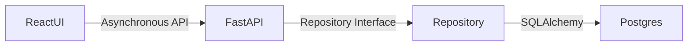
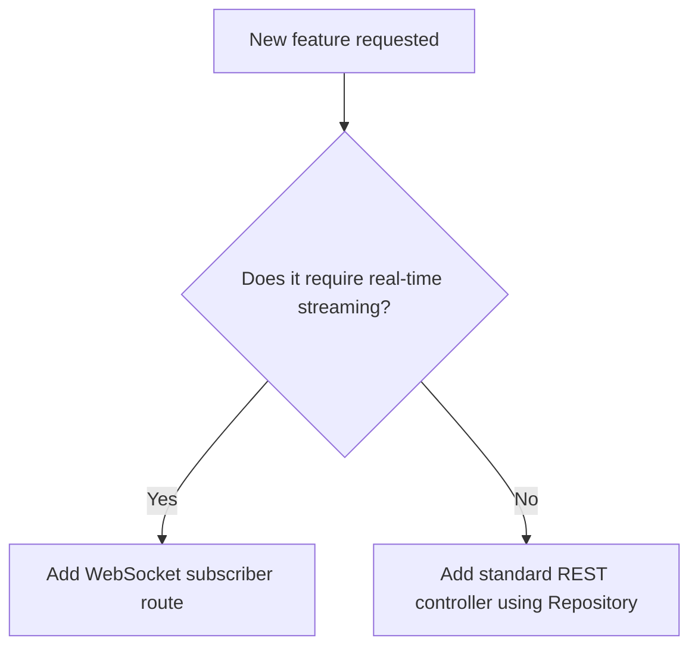

# 🏛️ Architecture Rules & Standards

## 1. Purpose
To maintain absolute separation of concerns, high scalability, and zero-leakage boundaries.

## 2. Scope
Applies to the multi-layered interactions between React frontends, FastAPI Gateways, and timeseries storage.

## 3. Core Principles
- **DDD & Clean Architecture**: Domain modeling must be pure and free from framework-specific database drivers or API bindings.
- **CQRS Principle**: Separate high-throughput timeseries reads from relational portfolio edits.
- **Dependency Inversion**: High-level policies must not depend on low-level detail. Both must depend on abstractions.

## 4. Mandatory Rules
- **Layer Integrity**: React can never talk to the database directly; it must route through FastAPI API endpoints.
- **Feature-First Structure**: Group modules by domain logic (e.g., `predictions`, `portfolio`) rather than purely technical roles (e.g., `controllers`, `views`).
- **No Synchronous Scrapes**: Scraper tasks must run asynchronously inside Celery workers; FastAPI routes can only queue or query results from Postgres.

## 5. Recommended Practices
- Keep DB interactions wrapped in SQLAlchemy repositories.
- Use WebSockets exclusively for high-fidelity live match feeds, reverting to standard REST for slip logs.

## 6. Examples

### 🟢 Good Architecture Diagram

## 7. Anti-patterns & Common Mistakes
- **Fat Controllers**: Placing SQL queries or Kelly sizer algorithms directly inside FastAPI router definitions.
- **Circular Imports**: Importing prediction models inside the portfolio module and vice-versa without interface wrappers.

## 8. Decision Tree: Decoupling States

## 9. Review Checklist
- [ ] Is domain logic isolated from FastAPI/SQLAlchemy framework references?
- [ ] Are background workers running asynchronously?
- [ ] Is there zero lookahead leakage?

## 10. Automation Opportunities
- ArchUnit-style tests in pytest validating package structure import rules.

## 11. Future Improvements
- Transition prediction calculations to a microservices architecture.

## 12. Revision History
- **v1.0.0**: Scaffolding clean layers, repository interfaces, and Celery worker separation.

## 13. Related Documents
- [Coding Rules](coding-rules.md)
- [Database Rules](database-rules.md)
