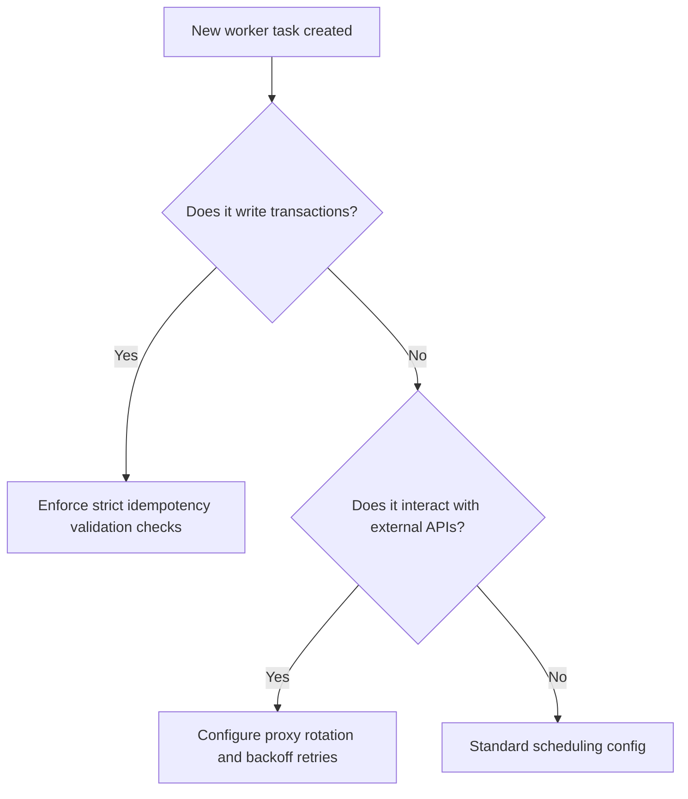

# ⚙️ Automation Rules & Background Task Standards

## 1. Purpose
To maintain resilient, idempotent, and highly available background task queues.

## 2. Scope
Applies to scraper crons, model drift evaluators, database cleanup workers, and alerting pipelines.

## 3. Core Principles
- **Strict Idempotency**: Running a background task multiple times must produce the exact same outcome. No double-allocation risks.
- **Fail Gracefully with Backoffs**: Network failures must execute structured exponential retry loops.
- **Total Observability**: Monitor task execution volumes, durations, and failure frequencies.

## 4. Mandatory Rules
- **Idempotent Slips**: Portfolio allocation tasks must match against unique identifiers to prevent duplicate logins.
- **Retry Backoff**: Celery worker tasks must implement exponential backoff loops ($5s, 15s, 60s, 300s$).
- **Scraper Proxy Rotation**: Scraper adapters must rotate target request profiles to bypass rate blocks.
- **Instant Alerts**: If tasks fail 3 consecutive times, trigger alerting webhooks to the dev channel immediately.

## 5. Recommended Practices
- Log execution durations to trace performance bottlenecks.
- Separate high-priority short tasks (slip log) from low-priority long tasks (historical scraping) using dedicated queues.

## 6. Examples

### 🟢 Good Idempotent Worker Design Pattern
```python
from celery import Celery
import time

app = Celery('tasks', broker='redis://localhost:6379/0')

@app.task(bind=True, max_retries=3)
def scrape_betway_odds(self, match_id: int):
    try:
        # Perform scraping operations
        pass
    except Exception as exc:
        # Exponential backoff retry: 5s, 25s, 125s
        retry_delay = 5 ** (self.request.retries + 1)
        raise self.retry(exc=exc, countdown=retry_delay)
```

## 7. Anti-patterns & Common Mistakes
- **Unbounded Retries**: Retrying tasks infinitely, resulting in worker queue blocks.
- **Double Stakes Execution**: Placing multiple slips because a worker thread completed slowly and triggered a second attempt.

## 8. Decision Tree: Task Scheduling


## 9. Review Checklist
- [ ] Are all transaction tasks designed to be strictly idempotent?
- [ ] Do external scraper workers implement proxy rotation?
- [ ] Are retry limits configured with exponential backoffs?

## 10. Automation Opportunities
- System monitoring suites track queue depths and automatically provision additional workers during busy weekends.

## 11. Future Improvements
- Implement self-healing schedules that automatically scale target request gaps based on active rate limits.

## 12. Revision History
- **v1.0.0**: Defined strict background worker and retry standards.

## 13. Related Documents
- [Performance Rules](performance-rules.md)
- [Logging Rules](logging-rules.md)
