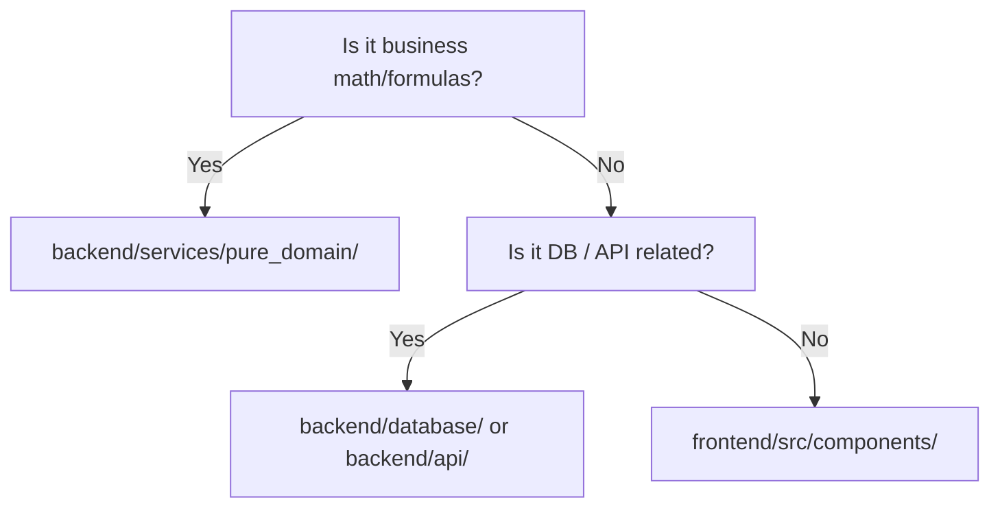

# 💻 Coding Rules & Standards

## 1. Purpose
To establish unified, mathematically-defensible, and type-safe development practices across Python (Backend) and TypeScript (Frontend).

## 2. Scope
Applies to all source code files, components, models, and helper scripts in the repository.

## 3. Core Principles
- **Predictability Over Cleverness**: Code must be obvious to both humans and LLM agents.
- **Strict Typing**: No implicit `any`, wildcards, or untyped API responses.
- **Fail Fast & Loudly**: Raise clean, structured errors as close to the failure point as possible.

## 4. Mandatory Rules
### Python Standards
- **Version Constraint**: Python 3.11+.
- **Formatting**: Enforced strictly by `Ruff` and `Black`.
- **Type Hints**: Mandatory for all function signatures and class variables. No exceptions.
- **File Organization**: Max file size is 500 lines. Split large modules into separate domain sub-modules.
- **Complexity**: Cyclomatic complexity per function must not exceed 10.

### TypeScript Standards
- **Version Constraint**: TypeScript 5.0+, React 19, Vite.
- **Import Rules**: Name imports strictly; do not use wildcard or object destructuring on imports.
- **Immutability**: Prefer `readonly` collections and state structures.
- **Asynchronous Standards**: Avoid raw promises; use `async/await` with clean `try/catch` handlers.

## 5. Recommended Practices
- Limit class sizes to 300 lines and function sizes to 30 lines.
- Keep dependency injections clean using FastAPI's dependency injection mechanisms.
- Define all constants and enums globally instead of hardcoding them.

## 6. Examples

### 🟢 Good Python Example (Calibrated Predictor)
```python
from typing import Dict, Any

class OutcomePredictor:
    """Predicts match probabilities using calibrated models."""
    
    def __init__(self, model_weights: Dict[str, float]) -> None:
        self.model_weights = model_weights

    def predict_probability(self, home_form: float, away_form: float) -> float:
        """Calculates a normalized probability between 0.0 and 1.0."""
        score = (home_form * self.model_weights.get("home", 0.5)) - (away_form * self.model_weights.get("away", 0.5))
        return 1.0 / (1.0 + (2.71828 ** -score))
```

### 🔴 Bad Python Example (No typing, magic numbers, lookahead risk)
```python
# No type hints, magic numbers, high complexity
def pred(h, a):
    s = h * 0.65 - a * 0.45
    return 1 / (1 + 2.718 ** -s) # Magic number, no calibration
```

## 7. Anti-patterns & Common Mistakes
- **Magic Numbers**: Hardcoding overrounds, tax rules, or Kelly risk limits outside configs.
- **Shadow Re-renders (React)**: Including raw objects or arrays directly in React `useEffect` dependencies.

## 8. Decision Tree: Where should code go?


## 9. Review Checklist
- [ ] Are all types explicitly declared?
- [ ] Does cyclomatic complexity stay under 10?
- [ ] Are there any un-isolated magic numbers?

## 10. Automation Opportunities
- Ruff linter executes automatically on pre-commit hooks.
- GitHub Actions blocks pull requests with implicit TS `any` typings.

## 11. Future Improvements
- Move all business math formulas into WASM packages to share exact client-server execution layers.

## 12. Revision History
- **v1.0.0**: Initial coding standards aligned with Python 3.11 and React 19.

## 13. Related Documents
- [Naming Rules](naming-rules.md)
- [Architecture Rules](architecture-rules.md)
