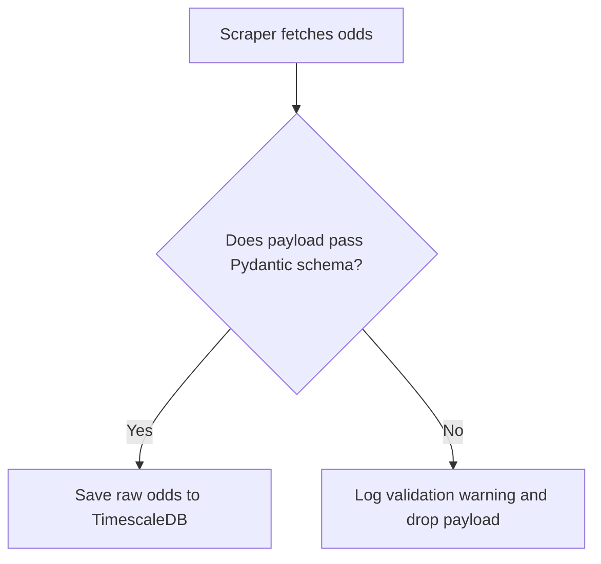

# 📊 Data Rules & Validation Standards

## 1. Purpose
To ensure total data quality, consistency, and traceability throughout ingestion and processing.

## 2. Scope
Applies to public tables, scraper payloads, feature stores, and relational data migrations.

## 3. Core Principles
- **Validation at Ingress**: Validate raw data immediately upon collection. Never allow malformed data into database tables.
- **Immutable Raw Logs**: Preserve raw ingested logs exactly as parsed. Do not modify source records.
- **Clear Data Lineage**: Document and trace feature calculations back to their original source tables.

## 4. Mandatory Rules
- **Pydantic Validation**: All incoming scraper structures must conform to and validate against Pydantic schemas.
- **Handling Missing Values**: Impute missing variables using clear, non-lookahead methodologies (e.g., historical group medians).
- **Outlier Bounds**: Detect and flag extreme odds or results (e.g., Odds < 1.01) before persistence operations.
- **Anonymization**: Never store PII or unencrypted credentials inside dataset entities.

## 5. Recommended Practices
- Maintain detailed logs of feature transformations to ensure ease of debugging.
- Run automated database health checks to identify dangling foreign keys or unindexed nodes.

## 6. Examples

### 🟢 Good Scraper Ingress Validation
```python
from pydantic import BaseModel, Field, field_validator
from datetime import datetime

class OddsScrapeDto(BaseModel):
    match_id: int
    bookmaker: str = Field(min_length=2, max_length=50)
    odds_home: float = Field(gt=1.0)
    odds_draw: float = Field(gt=1.0)
    odds_away: float = Field(gt=1.0)
    scraped_at: datetime

    @field_validator("odds_home")
    def validate_realistic_odds(cls, value: float) -> float:
        if value > 1000.0:
            raise ValueError("Odds are unrealistically high")
        return value
```

## 7. Anti-patterns & Common Mistakes
- **Silent Data Corruption**: Failing to check for empty strings or invalid float parses, resulting in downstream runtime crashes.
- **Mutating Historical Records**: Modifying live database rows to adjust features instead of logging new timeseries entries.

## 8. Decision Tree: Ingest Pipeline


## 9. Review Checklist
- [ ] Are all raw incoming payloads validated via Pydantic?
- [ ] Are outliers and anomalies handled securely?
- [ ] Is there clear lineage tracking for feature transformations?

## 10. Automation Opportunities
- Ingest pipelines automatically monitor payload volumes and raise alerts on drops.

## 11. Future Improvements
- Deploy real-time schema registry validation across all data-sharing interfaces.

## 12. Revision History
- **v1.0.0**: Initial data quality and Pydantic validation standards.

## 13. Related Documents
- [ML Rules](ml-rules.md)
- [Database Rules](database-rules.md)
