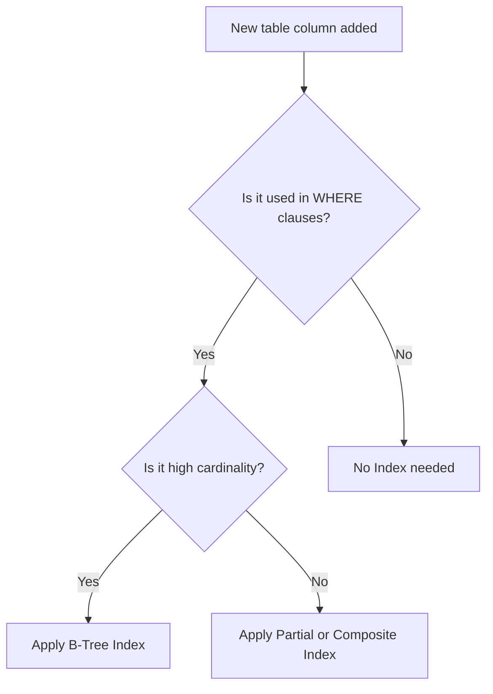

# 🗄️ Database Rules & Standards

## 1. Purpose
To ensure transactional safety, optimal indexing performance, and time-series efficiency for high-volume sports odds.

## 2. Scope
Applies to all database schemas, table modifications, indices, partitioning configurations, and raw SQL queries.

## 3. Core Principles
- **No Physical Deletes**: Soft deletes are mandatory for relational transactions and portfolios to maintain full audit logs.
- **Relational Integrity**: Foreign keys must always include cascading rules and explicit indices.
- **Partitioned Time-Series**: Store high-frequency bookmaker odds inside partitioned TimescaleDB hypertables.

## 4. Mandatory Rules
- **Naming Conventions**: Relational tables must use lowercase, plural snake_case. Column names must be singular snake_case.
- **Primary Keys**: Every relational table must define an autoincrementing integer primary key named `id`.
- **Soft Deletion**: Include an `is_deleted` boolean column indexed to filter records by default.
- **Audit Columns**: Every table must record `created_at` and `updated_at` timestamps in UTC.
- **Migrations**: No hand-written schema edits; all updates must be tracked with Alembic migration revisions.

## 5. Recommended Practices
- Use composite indices on composite query patterns (e.g., `match_id`, `updated_at`).
- Apply optimistic locking using an integer version column for concurrent slip settlements.

## 6. Examples

### 🟢 Good SQL Definition (Timescale Hypertable)
```sql
CREATE TABLE historical_odds (
    id SERIAL,
    match_id INT NOT NULL,
    bookmaker VARCHAR(50) NOT NULL,
    odds_home NUMERIC(5,2) NOT NULL,
    updated_at TIMESTAMP WITH TIME ZONE NOT NULL,
    PRIMARY KEY (id, updated_at)
);
SELECT create_hypertable('historical_odds', 'updated_at', chunk_time_interval => INTERVAL '7 days');
```

## 7. Anti-patterns & Common Mistakes
- **Unindexed Foreign Keys**: Creating a foreign key to `matches` without a corresponding index, leading to slow cascade checks.
- **Truncate Execution**: Emptying tables inside unit tests rather than rolling back transactions.

## 8. Decision Tree: Selecting Indexes


## 9. Review Checklist
- [ ] Are all table and column names in standard snake_case?
- [ ] Do foreign keys have corresponding indexes?
- [ ] Is Alembic migration checked and tested?

## 10. Automation Opportunities
- PR validation triggers check for direct raw SQL strings inside python code files.

## 11. Future Improvements
- Automated archival jobs moving older time-series data (>180 days) to cold object storage.

## 12. Revision History
- **v1.0.0**: Initial database standards featuring TimescaleDB patterns.

## 13. Related Documents
- [Architecture Rules](architecture-rules.md)
- [Performance Rules](performance-rules.md)
