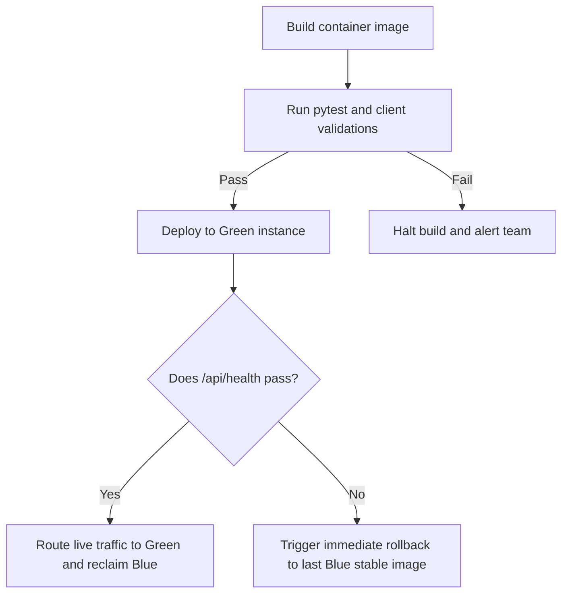

# 🐳 Deployment Rules & Release Standards

## 1. Purpose
To guarantee zero-downtime, fully secure, and observable production releases.

## 2. Scope
Applies to Docker configurations, container ingress paths, rollback triggers, and environment promotions.

## 3. Core Principles
- **Immutable Artifacts**: Production containers must be compiled once, tested, and promoted across environments unchanged.
- **Twelve-Factor App Configuration**: Store all application secrets and URLs strictly inside environment configurations.
- **Zero-Downtime Swaps**: Releases must execute blue-green deployment transitions to prevent user service drops.

## 4. Mandatory Rules
- **Ingress Mapping**: All external traffic routes exclusively through Nginx reverse proxies on container **Port 3000**.
- **Container Sizing**: Dockerfiles must use multi-stage builds to maintain a secure footprint under 300MB.
- **Health Verification**: Containers must expose a secure health endpoint (`/api/health`) returning status details.
- **Automatic Rollbacks**: Deployments must revert to the previous container image automatically if health checks fail.

## 5. Recommended Practices
- Execute smoke tests on green staging environments before shifting live DNS routing tables.
- Isolate development networks completely from production database replicas.

## 6. Examples

### 🟢 Good Multi-Stage Production Dockerfile Example
```dockerfile
# Stage 1: Build static assets and dependencies
FROM node:20-alpine AS builder
WORKDIR /app
COPY package*.json ./
RUN npm ci
COPY . .
RUN npm run build

# Stage 2: Clean production container
FROM node:20-alpine
WORKDIR /app
COPY --from=builder /app/dist ./dist
COPY package*.json ./
RUN npm ci --only=production
EXPOSE 3000
CMD ["node", "dist/server.cjs"]
```

## 7. Anti-patterns & Common Mistakes
- **Hardcoded URLs**: Embedding production API or database connection URLs directly inside Docker configurations.
- **Deploying Untested Containers**: Promoting images to production without passing automated test coverage benchmarks.

## 8. Decision Tree: Deployment Steps


## 9. Review Checklist
- [ ] Is multi-stage Docker compilation working?
- [ ] Is port 3000 mapped correctly?
- [ ] Do health checks execute automatically on startup?

## 10. Automation Opportunities
- Automated deployment pipelines triggered on main branch master merges.

## 11. Future Improvements
- Implement canary release loops to shift minor user percentages slowly to new updates.

## 12. Revision History
- **v1.0.0**: Initial deployment architecture specifications defined.

## 13. Related Documents
- [Architecture Rules](architecture-rules.md)
- [Performance Rules](performance-rules.md)
