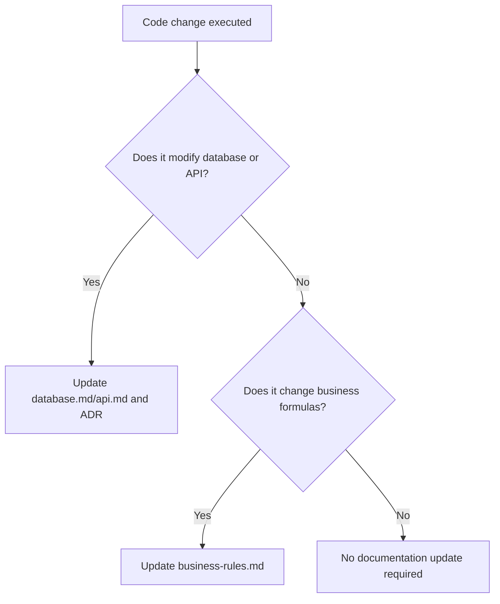

# 📖 Documentation Rules & Guidelines

## 1. Purpose
To preserve enterprise-grade architectural logic and complete algorithmic clarity for humans and AI agents.

## 2. Scope
Applies to markdown files, index documentations, Swagger definitions, and inline code documentation blocks.

## 3. Core Principles
- **Living Memory**: Documentation must represent the current actual system states; never let documents become stale.
- **Zero Ambiguity**: Business logic and math parameters must contain clear definitions with mathematical equations ($$\LaTeX$$).
- **Asymmetry Preservation**: Ensure all platform structures, directories, and data lineages are accurately represented.

## 4. Mandatory Rules
- **No Placeholders**: Never write TODOs, stubs, or placeholders inside rules or guides. All sections must be complete.
- **Mermaid Diagrams**: Complex sequence flows or architecture structures must utilize native Mermaid diagrams.
- **API Swagger Upgrades**: Every FastAPI modification must maintain fully typed Pydantic descriptions.
- **Refactoring Records**: Track major technical changes inside explicit Architecture Decision Records (ADR).

## 5. Recommended Practices
- Use clean Markdown syntax, checking links and image rendering before push operations.
- Cross-reference related files explicitly at the bottom of every rule document.

## 6. Examples

### 🟢 Good Dynamic Formulas
$$\text{Value Edge} = (\text{Bookmaker Odds} \times P_{\text{model}}) - 1.0 > 0.0$$

### 🔴 Bad Documentation Block
```
# Odds parser
TODO: Write how this works later when we finish the code.
```

## 7. Anti-patterns & Common Mistakes
- **Stale Context**: Updating core code files (e.g., adding a table) but neglecting database schema or architecture documentations.
- **Verbose Clutter**: Writing long paragraphs about standard setup steps instead of keeping guides highly scannable.

## 8. Decision Tree: When to update docs?


## 9. Review Checklist
- [ ] Are all equations rendered in valid LaTeX format?
- [ ] Is there zero placeholder text inside the file?
- [ ] Are related links fully resolved and correct?

## 10. Automation Opportunities
- Automated documentation link sweeps flag dead relative anchors on commits.

## 11. Future Improvements
- Deploy automated documentation build pipelines outputting high-fidelity static pages.

## 12. Revision History
- **v1.0.0**: Outlined platform documentation standards.

## 13. Related Documents
- [Coding Rules](coding-rules.md)
- [Git Rules](git-rules.md)
