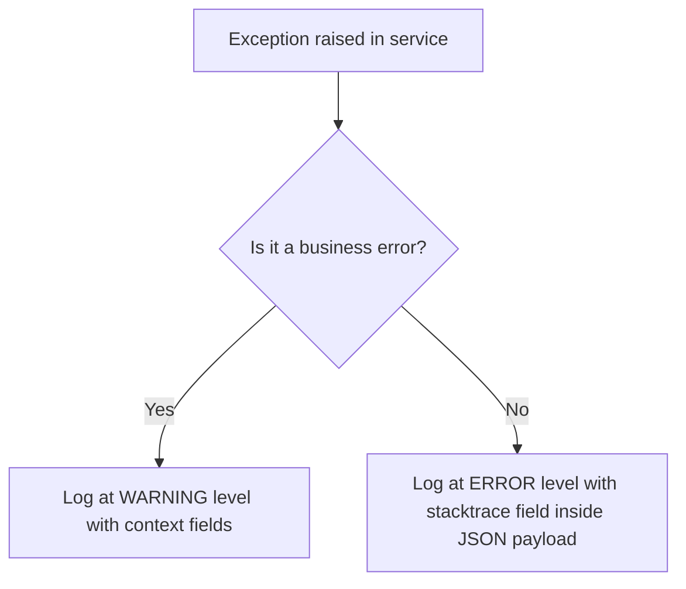

# 📝 Logging Rules & Structured Logging Standards

## 1. Purpose
To ensure full observability, instant diagnostics, and clear audit tracing on live production instances.

## 2. Scope
Applies to all application routers, background jobs, model execution logs, and transactional records.

## 3. Core Principles
- **Structure Over Text**: Raw text tracebacks are strictly banned. All server logs must use structured JSON.
- **Strict Anonymization**: Never log PII, passwords, private keys, or secure session credentials.
- **Trace Context Preservation**: Maintain trace identifiers across async queues and client interfaces.

## 4. Mandatory Rules
- **JSON Format**: Every log entry must compile as a valid single-line JSON document.
- **Correlated Logs**: API gateways must inject a `trace_id` header and propagate it to all background processes.
- **Log Levels**: Use levels correctly:
  - `INFO`: Standard server starts, scheduled jobs, slip additions.
  - `WARNING`: Rate limiting triggers, database retries, validation errors.
  - `ERROR`: Unhandled exceptions, scraper crashes, DB connection drops.
- **PII Scrubbing**: Logs must pass sanitization filters preventing key exposures.

## 5. Recommended Practices
- Log Kelly mathematical inputs alongside sizer execution runs to track potential deviations.
- Forward logs to central collectors using standard agents.

## 6. Examples

### 🟢 Good JSON Log Payload
```json
{"timestamp": "2026-06-28T22:42:35Z", "trace_id": "ab99-1223-aff6", "level": "INFO", "message": "Calculated value-betting slip", "edge": 0.144, "stake": 0.05}
```

## 7. Anti-patterns & Common Mistakes
- **Text Logs**: Using standard `print()` or unconfigured logging setups in production.
- **Sensitive Data Logging**: Outputting full request structures containing login passwords.

## 8. Decision Tree: Logging Exceptions


## 9. Review Checklist
- [ ] Are all log lines output as valid single-line JSON?
- [ ] Is the trace ID propagated cleanly across the service flow?
- [ ] Are passwords and API credentials sanitized?

## 10. Automation Opportunities
- Continuous monitoring systems alert on elevated counts of `ERROR` logs automatically.

## 11. Future Improvements
- Implement distributed trace dashboards tracking request times across micro-service calls.

## 12. Revision History
- **v1.0.0**: Structured JSON logging standards established.

## 13. Related Documents
- [Security Rules](security-rules.md)
- [Performance Rules](performance-rules.md)
