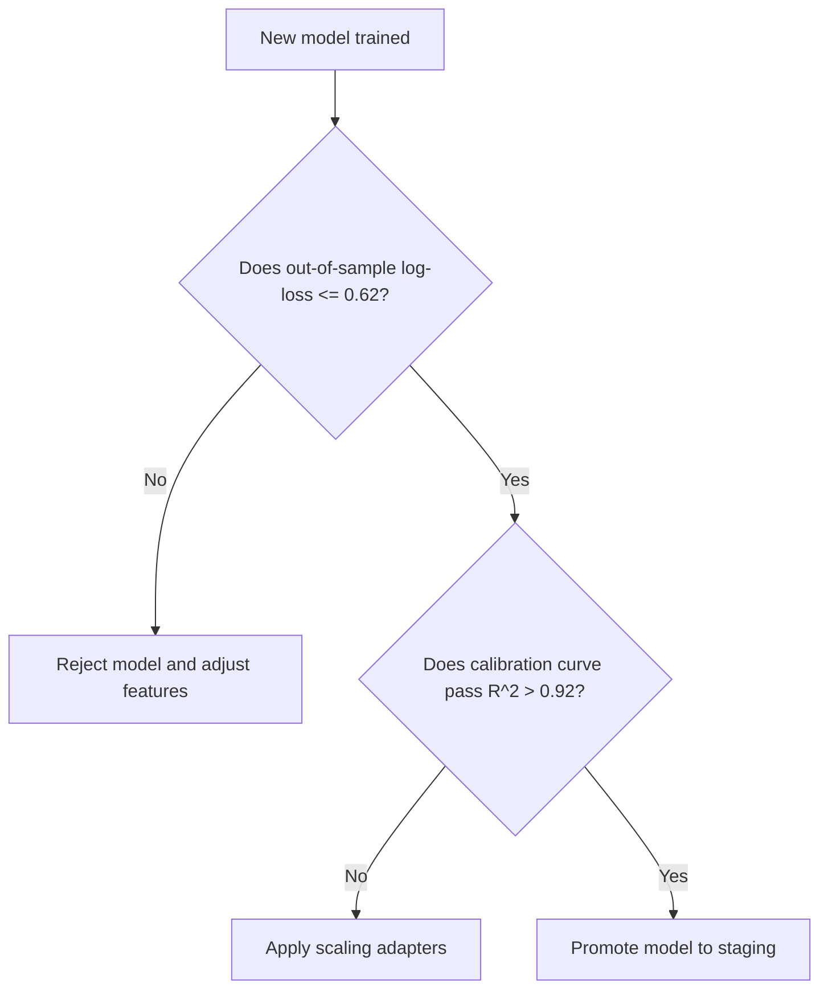

# 🧠 Machine Learning Rules & Modeling Standards

## 1. Purpose
To guarantee robust, calibrated, and reproducible predictions while eliminating lookahead risk.

## 2. Scope
Applies to training pipelines, feature store updates, calibration processes, and live inference.

## 3. Core Principles
- **Statistical Calibration Over Accuracy**: Focus on probability calibration (Platt Scaling) over raw binary classification accuracy.
- **Zero Lookahead Risk**: Enforce rigid chronological dataset splitting to prevent future results from polluting past parameters.
- **Reproducible Pipeline**: Ensure seed configurations, hyperparameter ranges, and feature logs are fully tracked.

## 4. Mandatory Rules
- **Calibration Check**: All outcome classifiers (LightGBM, XGBoost) must pass Platt Scaling calibration tests ($R^2 > 0.92$).
- **No Future Leakage**: Training pipelines must separate training features chronologically using strict timezone-aware indices.
- **Ensemble Validation**: Validate that overall log-loss scores on out-of-sample datasets remain below 0.62.
- **Weekly Evaluation**: Evaluate models weekly. Retrain if out-of-sample log-loss rises by more than 0.05 (model drift detection).

## 5. Recommended Practices
- Save model configurations as standardized, version-controlled serialized artifact matrices.
- Monitor feature importances dynamically to trace predictive performance shifts.

## 6. Examples

### 🟢 Good Calibration Validation Code Pattern
```python
from sklearn.calibration import CalibratedClassifierCV
from lightgbm import LGBMClassifier

def train_calibrated_model(X_train, y_train):
    """Trains a LightGBM model calibrated with Platt Scaling."""
    base_clf = LGBMClassifier(n_estimators=100, random_state=42)
    # Calibrate probabilities using sigmoid scaling (Platt Scaling)
    calibrated_clf = CalibratedClassifierCV(estimator=base_clf, method='sigmoid', cv=5)
    calibrated_clf.fit(X_train, y_train)
    return calibrated_clf
```

## 7. Anti-patterns & Common Mistakes
- **Random Splits on Timeseries**: Using standard random train-test splits on historical matches, causing lookahead leakage.
- **Uncalibrated Probabilities**: Using raw model outputs directly for Kelly stakes without overround removal or calibration.

## 8. Decision Tree: Model Promotion


## 9. Review Checklist
- [ ] Are datasets partitioned strictly on chronological boundaries?
- [ ] Has model calibration been computed and evaluated?
- [ ] Is out-of-sample log-loss under 0.62?

## 10. Automation Opportunities
- Automatic weekly drift monitors trigger retraining runs and update metrics dashboards.

## 11. Future Improvements
- Integrate neural sequencing layers (LSTM / Transformer networks) to process dynamic match-day events.

## 12. Revision History
- **v1.0.0**: Initial ML standards, lookahead controls, and calibration standards.

## 13. Related Documents
- [Data Rules](data-rules.md)
- [Testing Rules](testing-rules.md)
