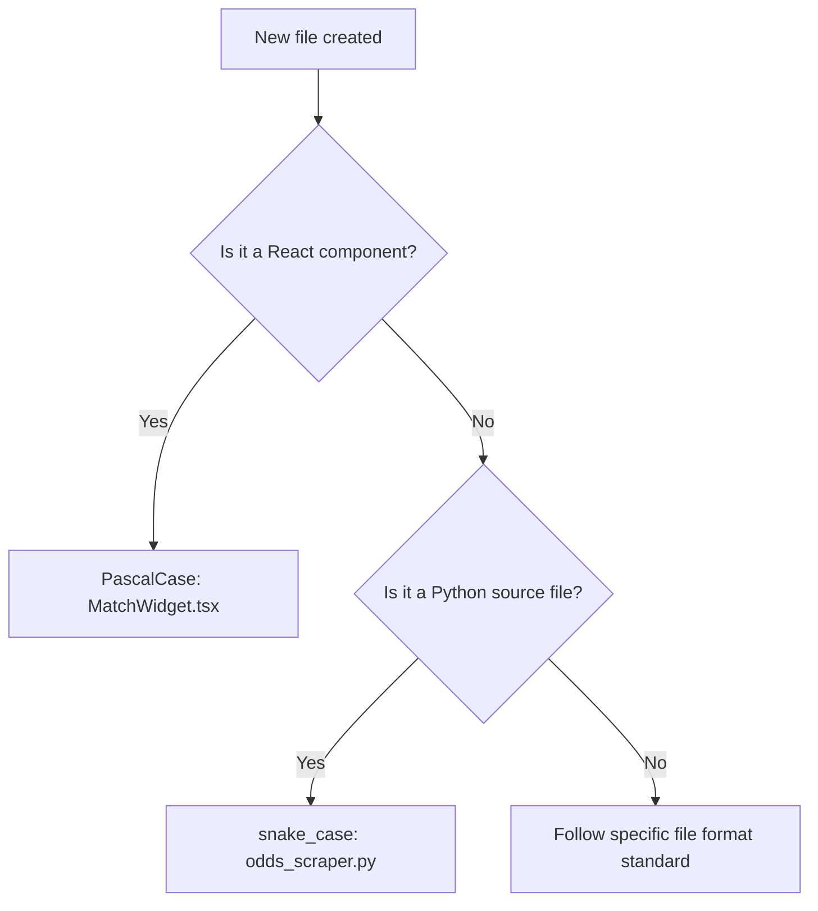

# 🏷️ Naming Rules & Conventions

## 1. Purpose
To eliminate cognitive overhead by maintaining completely predictable names.

## 2. Scope
Applies to all files, variables, folders, classes, routes, and environment parameters in the repository.

## 3. Core Principles
- **Descriptive Over Compact**: Prioritize readability over brief naming styles. Prefer `calculated_kelly_percentage` to `ckp`.
- **Aesthetic Pairings**: Match filenames and exports closely to their operational target domains.
- **Case Consistency**: Use standard case rules for different file types.

## 4. Mandatory Rules
- **Directories & Folders**: Lowercase, plural, separated by underscores (e.g., `backend/services/pure_domain/`).
- **Python Files**: snake_case (e.g., `match_evaluator.py`).
- **TypeScript Files**: PascalCase for React components (`PredictionCard.tsx`), camelCase for utility scripts (`formatOdds.ts`).
- **Python Classes**: PascalCase (`ValueBetFinder`).
- **Functions & Variables**: camelCase in TypeScript (`const isValueBet = ...`), snake_case in Python (`def get_best_odds(...)`).
- **Constants**: UPPERCASE snake_case (`MAX_SINGLE_ALLOCATION_PCT = 0.05`).

## 5. Recommended Practices
- Use prefixes for API routes reflecting their hierarchy (e.g., `/api/v1/predictions`).
- Always match environment variable naming keys to `.env.example`.

## 6. Examples

### Naming Table Matrix
| Entity | Case Style | Example |
| :--- | :--- | :--- |
| Folder / Directory | Lowercase snake_case | `portfolio_slips` |
| React Component | PascalCase | `KellySizerWidget.tsx` |
| Python Service | PascalCase | `SizerService` |
| Local Variable | camelCase (TS) / snake_case (Py) | `activeSlips` / `active_slips` |
| Database Table | Lowercase plural | `historical_odds` |

## 7. Anti-patterns & Common Mistakes
- **Hungarian Notation**: Prefixes like `str_name` or `arr_scores` inside modern typed code.
- **Ambiguous Flags**: Naming booleans `status` or `active` instead of descriptive names like `is_active` or `has_settled`.

## 8. Decision Tree: Creating Names

## 9. Review Checklist
- [ ] Are all React components written in PascalCase?
- [ ] Do constant variables use strict UPPERCASE snake_case?
- [ ] Are folders formatted in lowercase snake_case?

## 10. Automation Opportunities
- Ruff linter warns on non-snake_case functions in Python.

## 11. Future Improvements
- Strict folder and filename enforcement validation tools on commit.

## 12. Revision History
- **v1.0.0**: Initial naming standards established.

## 13. Related Documents
- [Coding Rules](coding-rules.md)
- [Database Rules](database-rules.md)
