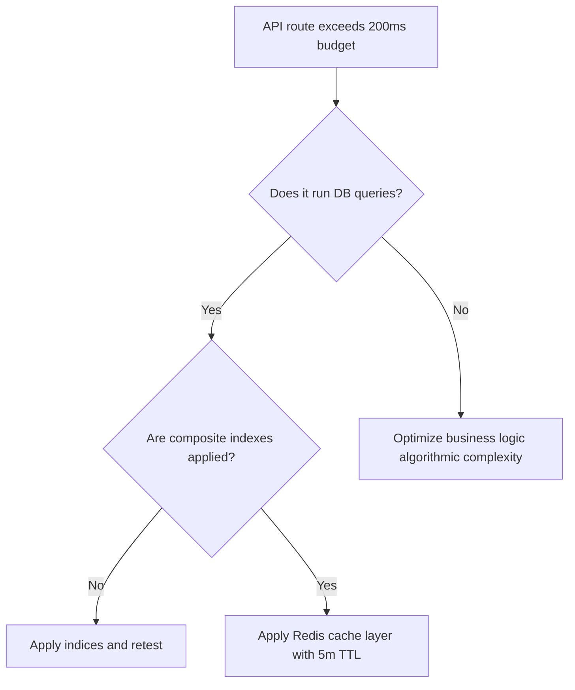

# ⚡ Performance Rules & Standards

## 1. Purpose
To guarantee sub-second rendering, instant calculations, and high async data ingestion throughput.

## 2. Scope
Applies to DB indexing, query execution pathways, API responses, React state updates, and worker scheduling.

## 3. Core Principles
- **No Lookups Inside Loops**: Prevent $O(N^2)$ calculations, especially in rolling timeseries evaluations.
- **Cache Volatile Aggregations**: Serve read-heavy match statistics directly from memory caching brokers.
- **Stateless Execution**: Minimize server session payloads to speed up container ingress.

## 4. Mandatory Rules
- **API Response Target**: REST API endpoints must return results in under 200ms at the 95th percentile.
- **Database Partitioning**: Maintain high-frequency time-series tables under active TimescaleDB hypertables.
- **React State Budget**: Minimize expensive parent components re-renders; memoize heavy charts using `useMemo`.
- **Connection Pools**: Database adapters must implement connection pooling to recycle active sessions.

## 5. Recommended Practices
- Use Redis keys with 5-minute TTL constraints for volatile match lists.
- Stream large odds datasets asynchronously instead of buffering files in memory.

## 6. Examples

### 🟢 Good Python Optimizations (Connection Reuse)
```python
# Reusing session pool structures instead of spawning DB connection on every iteration
from sqlalchemy.orm import scoped_session, sessionmaker
from sqlalchemy import create_engine

engine = create_engine("postgresql://...", pool_size=10, max_overflow=20)
SessionLocal = scoped_session(sessionmaker(bind=engine))
```

## 7. Anti-patterns & Common Mistakes
- **N+1 Queries**: Fetching matches and subsequently running individual queries to fetch odds for each match in a loop.
- **Unbounded React Renders**: Modifying state in components without restricting useEffect arrays.

## 8. Decision Tree: Optimize Pipeline


## 9. Review Checklist
- [ ] Are all high-frequency API responses cached?
- [ ] Are there zero N+1 database operations?
- [ ] Do heavy charting components use React memoization?

## 10. Automation Opportunities
- Performance test suites execute automated benchmark validations on master merges.

## 11. Future Improvements
- Transition to TimescaleDB continuous aggregate materialized views.

## 12. Revision History
- **v1.0.0**: Outlined sub-200ms latency standard configurations.

## 13. Related Documents
- [Database Rules](database-rules.md)
- [Logging Rules](logging-rules.md)
