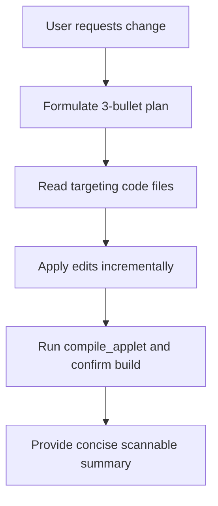

# 🧠 Prompt Rules & AI Behavior Standards

## 1. Purpose
To govern how AI assistants interpret prompt contexts, design plans, and execute code within the repository.

## 2. Scope
Applies to all developer-to-AI interactions, prompt specifications, and autonomous development loops.

## 3. Core Principles
- **No Speculative Actions**: Always inspect current file states before attempting edits. Never assume structures.
- **Incremental Implementation**: Execute changes in logical, modular steps; verify code builds after each change.
- **Strict Compliance**: The instructions in `.ai/rules/` and `.ai/context/` are absolute. No AI generation may bypass them.

## 4. Mandatory Rules
- **Read First**: Always call `view_file` on targeting files before issuing `edit_file` or `multi_edit_file` operations.
- **Formulate Design Plan**: For any change request, formulate a maximum 3-bullet plan before starting coding, unless the user requests informational feedback.
- **Fail Gracefully**: If a build fails, analyze the logs, correct the targeted file, and compile again. Limit consecutive attempts to 3.
- **No Mock Stubs**: AI assistants must write production-ready, fully typed code. Fake placeholders or simulated databases are strictly forbidden.

## 5. Recommended Practices
- Summarize final accomplishments using clear, humble, and design-focused outcomes.
- Proactively suggest updating `AGENTS.md` or `GEMINI.md` when encountering repetitive design constraints.

## 6. Examples

### 🟢 Good AI Thinking Process
1. Inspect `metadata.json` and `package.json` to verify active project scopes.
2. Read targeting components explicitly to locate target lines.
3. Apply precise edits, run `compile_applet` to confirm build status, and summarize outcomes.

## 7. Anti-patterns & Common Mistakes
- **Over-Engineering**: Implementing unrequested pages, sidebars, or complex layouts for simple single-view tools.
- **Loose API Calls**: Guessing route paths or database properties instead of inspecting existing codebase states.

## 8. Decision Tree: AI Execution Path

## 9. Review Checklist
- [ ] Did the AI assistant formulate a 3-bullet plan before coding?
- [ ] Were all modified files read immediately before editing?
- [ ] Did the build compile successfully?

## 10. Automation Opportunities
- Prompt rules are automatically injected into system contexts for every turn of the agent.

## 11. Future Improvements
- Continuous fine-tuning of system templates to optimize structural alignment with project architectures.

## 12. Revision History
- **v1.0.0**: Outlined mandatory AI behavior rules.

## 13. Related Documents
- [AI Rules](ai-rules.md)
- [Review Rules](review-rules.md)
