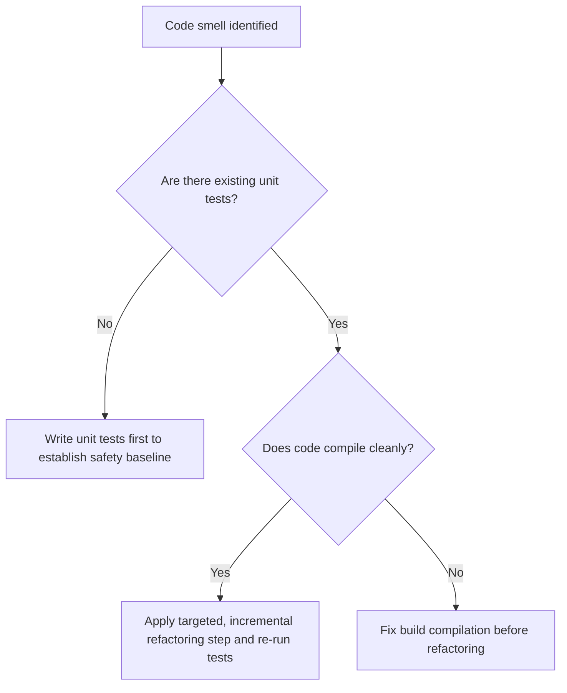

# 🔄 Refactoring Rules & Standards

## 1. Purpose
To ensure code remains highly maintainable without introducing regressions or changing functional outcomes.

## 2. Scope
Applies to all code refactoring exercises, cleanup branches, and dependency upgrades.

## 3. Core Principles
- **Refactor vs. Feature Separation**: Refactoring must never be mixed with feature development or bug fixes in the same branch.
- **Regression Proofing**: Verify existing test coverage before modifying code. Run the test suite before and after refactoring.
- **Incremental Steps**: Apply small, targeted edits. Avoid rewriting entire modules in single sweeps.

## 4. Mandatory Rules
- **No Behavioral Changes**: Refactoring must only change code structure, never functional outputs or business mathematics.
- **Verify test budgets**: If coverage declines after refactoring, the change must be rejected.
- **Deprecation Warning**: Mark outdated interfaces or modules with explicit deprecation annotations prior to final removal.
- **Review gates**: Major refactoring sweeps must be backed by an Architecture Decision Record (ADR).

## 5. Recommended Practices
- Write structural unit tests to guard complex math formulas before altering their internal paths.
- Avoid cleaning code simply to match styling preferences unless it strictly improves cyclomatic complexity scores.

## 6. Examples

### 🟢 Good Refactoring (Decoupled Sizer Logic)
```python
# Decoupling sizer parameters from DB objects to allow unit test execution without database connection
def calculate_stake(bankroll: float, odds: float, probability: float) -> float:
    # Isolated business math
    return bankroll * ((odds * probability - 1) / (odds - 1)) * 0.1
```

## 7. Anti-patterns & Common Mistakes
- **Refactogedon**: Making extensive edits across multiple domains at once, resulting in un-mergeable branches.
- **Sneaking Features**: Slipping minor functional requests inside refactoring commits.

## 8. Decision Tree: When is refactoring allowed?


## 9. Review Checklist
- [ ] Did functional outcomes remain 100% identical?
- [ ] Has the test suite been executed with green results?
- [ ] Are deprecation timelines explicitly documented?

## 10. Automation Opportunities
- Linter checks and test coverages run automatically in pre-commit loops to guard against regressions.

## 11. Future Improvements
- Integrate automated code smell analysis tools flagging high complexity indices.

## 12. Revision History
- **v1.0.0**: Outlined strict refactoring safety policies.

## 13. Related Documents
- [Coding Rules](coding-rules.md)
- [Testing Rules](testing-rules.md)
