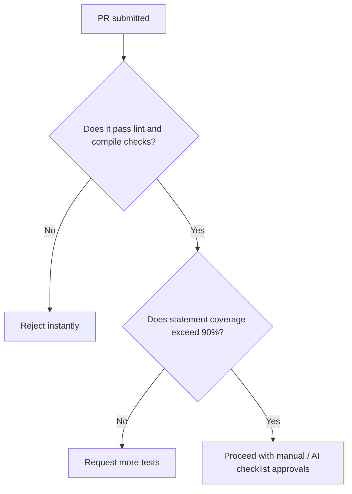

# 🔍 Code Review Rules & Quality Gateways

## 1. Purpose
To maintain zero-compromise engineering standards through clean, structured review checklists.

## 2. Scope
Applies to all pull requests, feature merges, and repository updates.

## 3. Core Principles
- **Objective Criteria**: Reviews must evaluate code against concrete guidelines rather than personal opinions.
- **Automation First**: Linter and compile checks must pass before a human or AI reviewer begins evaluation.
- **Rigorous Proofs**: Ensure all math, models, and security limits are validated during review gates.

## 4. Mandatory Rules
- **Linter Gates**: No human review may occur until `Ruff` and `npm run lint` compile with zero errors.
- **Coverage Minimums**: PRs reducing coverage budgets below the 90% threshold must be rejected.
- **Security Scans**: Evaluate all PRs for secrets leaks, unprotected endpoints, and SQL parameters.
- **Calibrated Verification**: Ensure machine learning modifications include out-of-sample log-loss reviews.

## 5. Recommended Practices
- Standardize PR templates requiring code authors to list related tickets and test instructions explicitly.
- Maintain a friendly, supportive tone in all feedback cycles.

## 6. Comprehensive Review Checklist Matrix

### 📁 Architecture Review
- [ ] Code strictly respects layer integrity boundaries.
- [ ] Repository pattern is used for all database operations.
- [ ] No circular dependencies exist between domains.

### 🛡️ Security Review
- [ ] All API credentials remain strictly server-side.
- [ ] Inputs are fully validated and parameterized.
- [ ] CORS is restricted to production domains.

### ⚡ Performance Review
- [ ] Database queries are indexed. No N+1 queries.
- [ ] Volatile API endpoints are cached (Redis).
- [ ] React components are memoized.

### 🧪 Testing Review
- [ ] Statement coverage meets the 90% threshold.
- [ ] Mock adapters isolate tests from external networks.
- [ ] Lookahead bias detection tests are implemented.

## 7. Anti-patterns & Common Mistakes
- **LGTM Reviews**: Approving PRs quickly without active code execution or test verifications.
- **Mixing Scope**: Bundling unrelated refactoring inside a bugfix pull request.

## 8. Decision Tree: PR Acceptance

## 9. Automation Opportunities
- Automatic GitHub checks block merging until all unit tests and security reviews pass.

## 11. Future Improvements
- Deploy AI reviewer bots to comment on standard naming and architecture rules automatically.

## 12. Revision History
- **v1.0.0**: Initial code review pipeline configuration.

## 13. Related Documents
- [Coding Rules](coding-rules.md)
- [Security Rules](security-rules.md)
