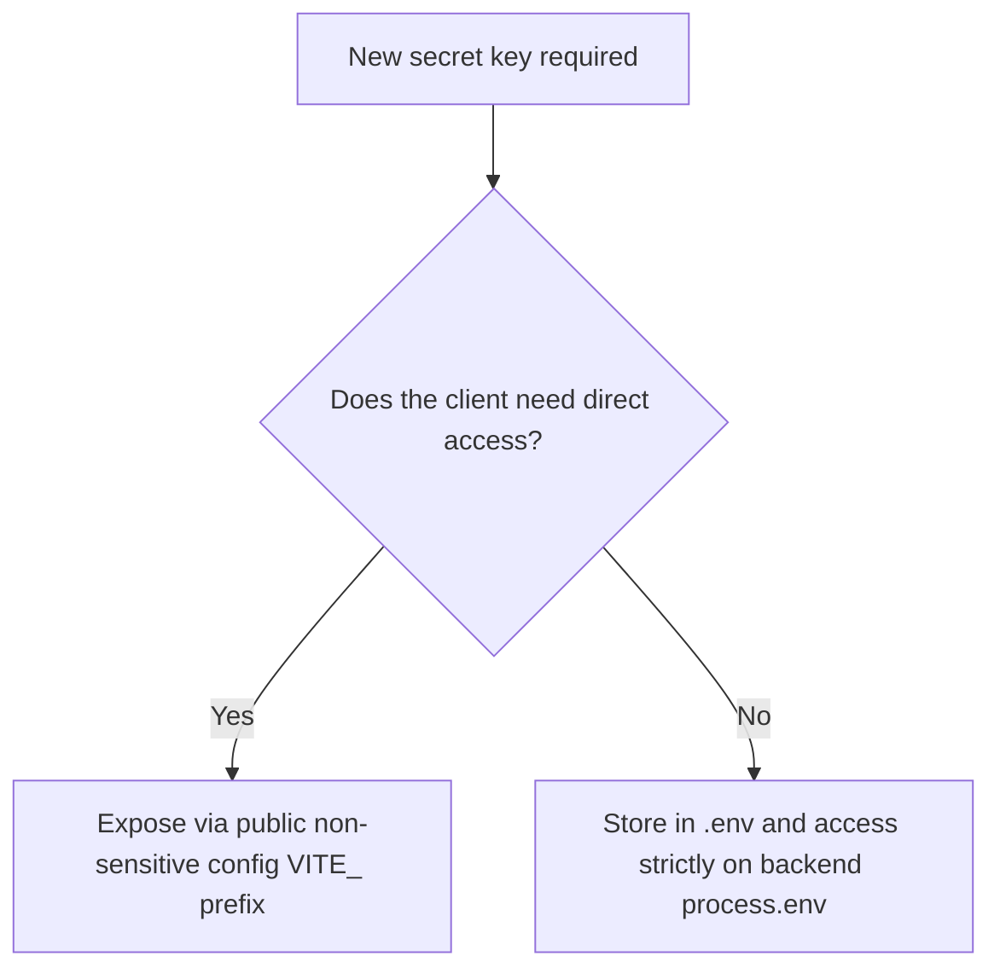

# 🛡️ Security Rules & Standards

## 1. Purpose
To ensure strict security and full protection against the OWASP Top 10 vulnerabilities.

## 2. Scope
Applies to client-side input validation, API gateways, database persistence, and configuration secrets.

## 3. Core Principles
- **Defense in Depth**: Do not rely on single-point security check gates; validate access at the frontend, API, and repository levels.
- **Least Privilege Principle**: API tokens, database clients, and service accounts must hold the absolute minimum rights.
- **Secure By Default**: All endpoints are closed, secured, and authorized unless explicitly whitelisted.

## 4. Mandatory Rules
- **No Client Keys**: All API keys, including the Gemini API key, must reside strictly on the server side. Never expose them to browser clients.
- **SQL Injection Prevention**: Direct raw SQL string execution is strictly banned. Use SQLAlchemy parameterized query models.
- **Cryptographic Signatures**: Use Argon2id for password hashing. JWT keys must be generated using strong high-entropy seeds.
- **Input Sanitization**: Escape all incoming strings to block Cross-Site Scripting (XSS) and SQL Injection vectors.

## 5. Recommended Practices
- Limit JWT lifetimes to 15 minutes, refreshing credentials through secure, HTTP-only cookies.
- Execute automated dependency vulnerability sweeps weekly.

## 6. Examples

### 🟢 Good Security Isolation (Server-Side Proxy Pattern)
```typescript
// In server.ts (Node backend / Express Proxy)
import { GoogleGenAI } from "@google/genai";

const ai = new GoogleGenAI({ apiKey: process.env.GEMINI_API_KEY });
app.post("/api/predictions/evaluate", async (req, res) => {
    // API key stays hidden from the client browser
    const response = await ai.models.generateContent({
        model: 'gemini-2.5-flash',
        contents: req.body.prompt
    });
    res.json(response);
});
```

## 7. Anti-patterns & Common Mistakes
- **Client-Side Secrets**: Initializing payment gateways or AI frameworks on React clients using private secret keys.
- **Loose CORS Policies**: Setting `Access-Control-Allow-Origin: * ` on production instances.

## 8. Decision Tree: Storing Secrets


## 9. Review Checklist
- [ ] Is there zero private secret key leakage inside git repositories?
- [ ] Are all database operations fully parameterized?
- [ ] Is CORS configured with an explicit production domain whitelist?

## 10. Automation Opportunities
- GitHub security alerts track raw secrets and private key leaks automatically.

## 11. Future Improvements
- Implement mutual TLS (mTLS) configurations across database-to-gateway layers.

## 12. Revision History
- **v1.0.0**: Strict server-side secrets rule configuration and parameterized queries.

## 13. Related Documents
- [Database Rules](database-rules.md)
- [API Rules](api-rules.md)
