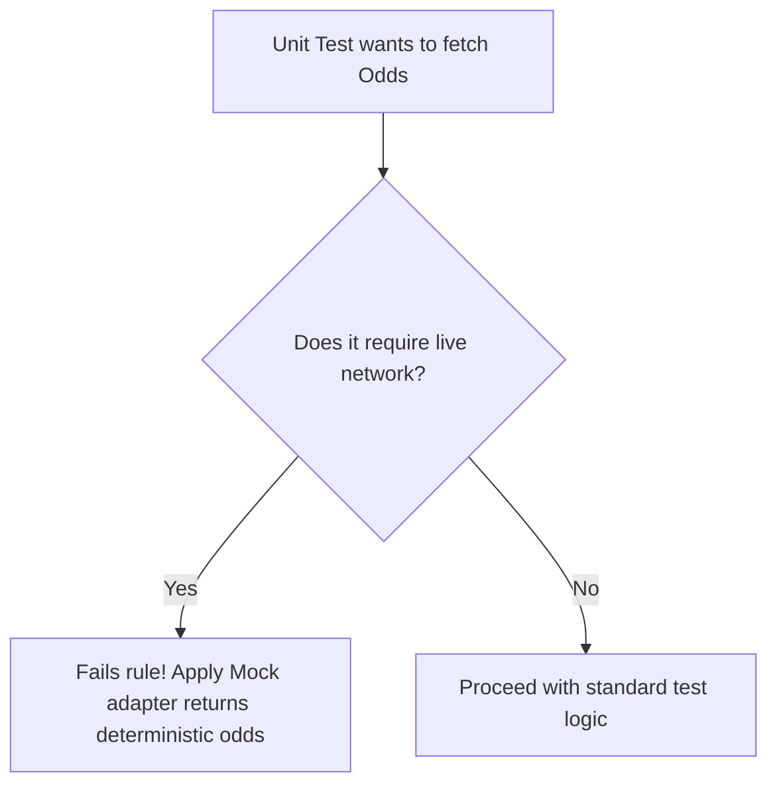

# 🧪 Testing Rules & Quality Mandates

## 1. Purpose
To achieve 100% mathematical precision for Kelly allocation pipelines and zero-lookahead ML prediction models.

## 2. Scope
Applies to Pytest units, integration scenarios, end-to-end user flows, and model drift backtesting scripts.

## 3. Core Principles
- **Isolation**: Tests must never communicate with external bookmaker servers. Use mock responses.
- **Deterministic Repetition**: Math, stats, and Kelly calculations must produce identical outcomes given identical inputs.
- **Safety Verification**: Ensure maximum single bankroll limits (5.0%) can never be breached, even with highly skewed inputs.

## 4. Mandatory Rules
- **Coverage Budgets**: Minimum 90% statement coverage on backend modules, and 100% coverage on value calculations and sizing algorithms.
- **Lookahead Leakage Testing**: Unit tests must actively check that feature engineering never references match properties scheduled later than the target time.
- **Database Rollback**: Integration tests must execute inside transactions that roll back automatically after completion.
- **E2E Playwright Tests**: Core visual paths (calendar, portfolio, sizer sliders) must be verified via Playwright.

## 5. Recommended Practices
- Use deterministic mock templates for database factories rather than hardcoded SQL records.
- Run the full test suite before any PR merges.

## 6. Examples

### 🟢 Good Kelly Criterion Unit Test
```python
def test_kelly_sizer_absolute_max():
    """Verify that Kelly calculations clamp stakes to 5.0% under any circumstance."""
    from services.kelly_sizer import calculate_kelly_fraction
    
    # Highly skewed parameters (Odds = 10.0, true probability = 99%)
    fraction = calculate_kelly_fraction(odds=10.0, true_probability=0.99, risk_coeff=0.25)
    
    # Absolute platform cap is 5.0% (0.05)
    assert fraction <= 0.05
```

## 7. Anti-patterns & Common Mistakes
- **No Assertions**: Writing tests that execute code but fail to verify properties.
- **Production DB Pollution**: Running tests directly against live TimescaleDB databases.

## 8. Decision Tree: Mocking Strategy


## 9. Review Checklist
- [ ] Is test coverage over 90%?
- [ ] Are all mock frameworks isolated from live third-party network connections?
- [ ] Is lookahead leakage fully tested?

## 10. Automation Opportunities
- GitHub Actions automatically runs `pytest` and `npm run test` on every push.

## 11. Future Improvements
- Automated mutation testing to assess quality boundaries on value-finding algorithms.

## 12. Revision History
- **v1.0.0**: Configured rigorous math verification tests.

## 13. Related Documents
- [Coding Rules](coding-rules.md)
- [Performance Rules](performance-rules.md)
