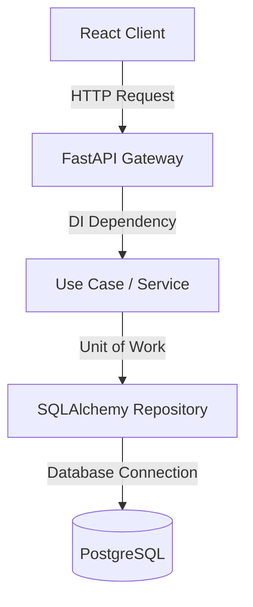

# 🐍 Enterprise Backend Development

## 1. Purpose
This guide defines standards for implementing enterprise-grade, highly testable, and robust FastAPI backends in Python.

## 2. When to Use
- Implementing REST API routers, background workers (Celery), database integrations, and math modeling pipelines.

## 3. When NOT to Use
- Developing client-side rendering (handled strictly in the React frontend).

## 4. Architecture


## 5. Step-by-Step Implementation
1. **Define DTOs**: Create Pydantic input and output schemas.
2. **Define Repositories**: Establish repository interfaces and implementations.
3. **Define Services**: Build business-logic domain service engines.
4. **Implement Controllers / Routers**: Route parameters and apply dependency injection.

## 6. Repository Standards
- All route dependencies must use FastAPI `Depends`.
- All database mutations must occur inside a Unit of Work transactional block.

## 7. Examples

### FastAPI Controller with Dependency Injection
```python
from fastapi import APIRouter, Depends, HTTPException, status
from pydantic import BaseModel
from typing import List

class MatchPredictionResponse(BaseModel):
    match_id: int
    home_probability: float
    away_probability: float

router = APIRouter(prefix="/predictions", tags=["predictions"])

def get_prediction_service():
    # Service factory dependency injection
    return PredictionService()

@router.get("/{match_id}", response_model=MatchPredictionResponse)
async def read_prediction(match_id: int, service: PredictionService = Depends(get_prediction_service)):
    prediction = await service.get_prediction_by_id(match_id)
    if not prediction:
        raise HTTPException(
            status_code=status.HTTP_404_NOT_FOUND,
            detail="Prediction not found"
        )
    return MatchPredictionResponse(
        match_id=prediction.match_id,
        home_probability=prediction.home_prob,
        away_probability=prediction.away_prob
    )
```

## 8. Best Practices
- Keep endpoints lightweight; delegate business logic completely to service layers.
- Implement structured JSON logs for all operational exceptions.

## 9. Anti-patterns
- **Fat Routers**: Querying the database directly within routers without services or repository abstractions.

## 10. Security Considerations
- Validate all incoming parameters with strict Pydantic rules.
- Prevent SQL injection by strictly utilizing SQLAlchemy's parameterized queries.

## 11. Performance Considerations
- Use `async/await` for non-blocking I/O operations.
- Reuse database connections via SQLAlchemy connection pooling configurations.

## 12. Testing Strategy
- Use `pytest` and `httpx.AsyncClient` to verify controller endpoints in isolation.

## 13. Review Checklist
- [ ] Are all route signatures typed with explicit Pydantic DTO schemas?
- [ ] Is exception handling structured returning compliant RFC-7807 payloads?

## 14. Common Mistakes
- Omitting standard timeout parameters inside outbound API client operations.

## 15. Future Improvements
- Move to automated gRPC compilation for internal microservice communication interfaces.

## 16. Revision History
- **v1.0.0**: Outlined enterprise-grade REST architecture.

## 17. Related References
- Skills: [FastAPI](fastapi.md), [Python](python.md)
- Rules: [Coding Rules](../rules/coding-rules.md)
