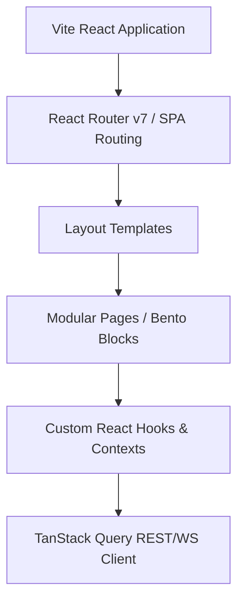

# ⚛️ Enterprise Frontend Development

## 1. Purpose
This guide defines standards for writing robust, performant, and type-safe user interfaces in React 19 and Vite.

## 2. When to Use
- Developing interactive, responsive browser interfaces, bento dashboards, and betting slip transaction visualizers.

## 3. When NOT to Use
- Performing raw timeseries aggregations, scrapers, or sensitive financial maths (always delegated to the Python backend).

## 4. Architecture


## 5. Step-by-Step Implementation
1. **Establish File Layouts**: Put modular components in `src/components/` and pages in `src/pages/`.
2. **Define State Store**: Leverage simple React local states and lightweight contexts.
3. **Integrate Server Queries**: Call FastAPI backend routes using TanStack Query queries.
4. **Build Charts**: Render responsive, accessible analytics using Recharts.

## 6. Repository Standards
- Absolutely no TS `any` declarations. Use strict typescript compiler flags.
- Use named exports for components and helper files.

## 7. Examples

### Type-Safe React Component with Custom Hooks
```typescript
import React, { useState } from 'react';

interface SlipSizerProps {
  id: string;
  initialStake: number;
  onStakeChange: (newStake: number) => void;
}

export const SlipSizerWidget: React.FC<SlipSizerProps> = ({ id, initialStake, onStakeChange }) => {
  const [stake, setStake] = useState<number>(initialStake);

  const handleUpdate = (value: number) => {
    setStake(value);
    onStakeChange(value);
  };

  return (
    <div id={id} className="p-6 bg-slate-900 border border-slate-800 rounded-xl shadow-lg">
      <h3 className="text-sm font-sans font-medium tracking-tight text-slate-200">Stake Sizing Sizer</h3>
      <div className="mt-4 flex items-center justify-between">
        <span className="text-xs font-mono text-slate-400">Current allocation:</span>
        <span className="text-sm font-mono text-green-400 font-bold">${stake.toFixed(2)}</span>
      </div>
      <input
        id={`input-range-${id}`}
        type="range"
        min={0}
        max={100}
        value={stake}
        onChange={(e) => handleUpdate(Number(e.target.value))}
        className="w-full mt-4 h-1 bg-slate-800 rounded-lg appearance-none cursor-pointer"
      />
    </div>
  );
};
```

## 8. Best Practices
- Standardize spacing using responsive Tailwind margin, padding, and layout units.
- Keep components modular and single-purpose.

## 9. Anti-patterns
- **Monolithic App.tsx**: Dumping charts, login forms, and routing configs all into a single file.

## 10. Security Considerations
- Escape all rendered strings to block XSS (Cross-Site Scripting).
- Never store sensitive access keys or private tokens inside local client assets.

## 11. Performance Considerations
- Avoid raw arrays and objects inside React `useEffect` dependencies to prevent infinite re-render loops.
- Lazy load major sub-routes using React `lazy` and Suspense templates.

## 12. Testing Strategy
- Execute UI component unit tests using React Testing Library and E2E scenarios via Playwright.

## 13. Review Checklist
- [ ] Do components provide correct `id` fields for automation checks?
- [ ] Do layout colors maintain robust AAA accessibility requirements?

## 14. Common Mistakes
- Forgetting to properly clean up open WebSocket subscribers upon component unmounting.

## 15. Future Improvements
- Move to compile-time React Server Components (RSC) to increase initial load performance.

## 16. Revision History
- **v1.0.0**: Initial client architecture configured for React 19.

## 17. Related References
- Skills: [Playwright](playwright.md)
- Rules: [Coding Rules](../rules/coding-rules.md)
