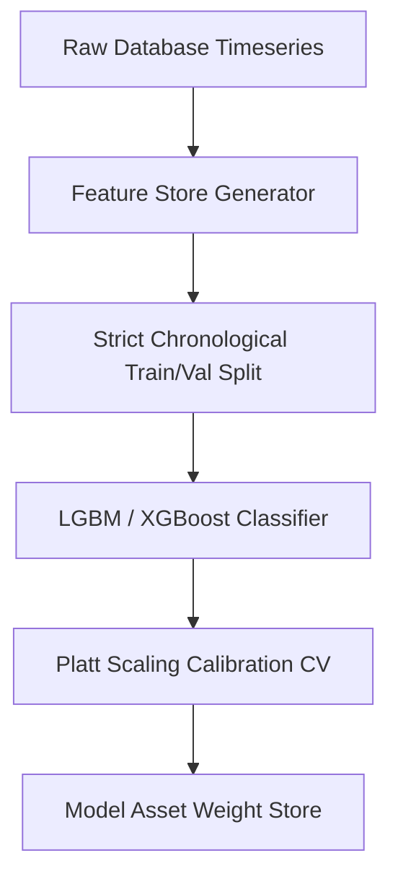

# 🧠 Machine Learning Engineering Standards

## 1. Purpose
To define strict guidelines for training, validating, calibrating, and serving sports prediction ML models without risk of lookahead bias.

## 2. When to Use
- Building team form predictors, expected goals estimators, or live odds adjustment algorithms.

## 3. When NOT to Use
- Writing static database rules or pure, deterministic mathematical models.

## 4. Architecture
Our ML pipeline processes historical matches chronologically, calibrates predictions, and stores weights:


## 5. Step-by-Step Implementation
1. **Chronological Splitting**: Partition data chronologically (never randomly) to eliminate lookahead bias.
2. **Feature Generation**: Compute lagged rolling variables using past records only.
3. **Train & Tune**: Train classifiers and evaluate log-loss benchmarks.
4. **Calibrate**: Scale probabilities using Platt Scaling (Sigmoid) or Isotonic regression to ensure accuracy.

## 6. Repository Standards
- Minimum validation standard: Out-of-sample log-loss must remain below 0.62.
- Calibration validation ($R^2$) must be greater than 0.92 before deployment.

## 7. Examples

### Chronological Train-Val Split with Platt Scaling Calibration
```python
import pandas as pd
import numpy as np
from sklearn.calibration import CalibratedClassifierCV
from lightgbm import LGBMClassifier

def run_calibrated_pipeline(df: pd.DataFrame) -> CalibratedClassifierCV:
    """Trains and calibrates a sports prediction model chronologically."""
    # Ensure correct chronological ordering
    df = df.sort_values("match_date").reset_index(drop=True)
    
    # Chronological Split: Train on past, validate on future
    split_idx = int(len(df) * 0.8)
    train_df = df.iloc[:split_idx]
    val_df = df.iloc[split_idx:]
    
    features = ["rolling_xg", "team_elo_diff", "rest_days_diff"]
    target = "home_win"
    
    X_train, y_train = train_df[features], train_df[target]
    
    # Initialize base classifier
    base_clf = LGBMClassifier(n_estimators=100, random_state=42, n_jobs=-1)
    
    # Use Sigmoid Platt Scaling across chronological folds
    calibrated_clf = CalibratedClassifierCV(estimator=base_clf, method='sigmoid', cv=5)
    calibrated_clf.fit(X_train, y_train)
    
    return calibrated_clf
```

## 8. Best Practices
- Verify feature values never leak future info (e.g. including goals scored in the current match).
- Save serialized model models cleanly inside standard folders with version tags.

## 9. Anti-patterns
- **Random Split on Timeseries**: Splitting sports data randomly across dates, causing lookahead leakage.

## 10. Security Considerations
- Validate incoming live features against schema definitions before pushing them to inference runtimes.

## 11. Performance Considerations
- Use sparse matrix structures where appropriate to reduce memory footprint.

## 12. Testing Strategy
- Implement automated tests that verify prediction arrays sum to 1.0 (Home + Draw + Away).

## 13. Review Checklist
- [ ] Is training split chronologically by match dates?
- [ ] Does the model's calibration curve pass the $R^2 > 0.92$ threshold?

## 14. Common Mistakes
- Relying on raw model scores for financial Kelly allocations instead of calibrated probabilities.

## 15. Future Improvements
- Implement automated feature drift triggers that start a retraining run when feature distributions shift.

## 16. Revision History
- **v1.0.0**: Outlined strict ML standards and calibration.

## 17. Related References
- Skills: [XGBoost](xgboost.md), [LightGBM](lightgbm.md)
- Rules: [ML Rules](../rules/ml-rules.md)
