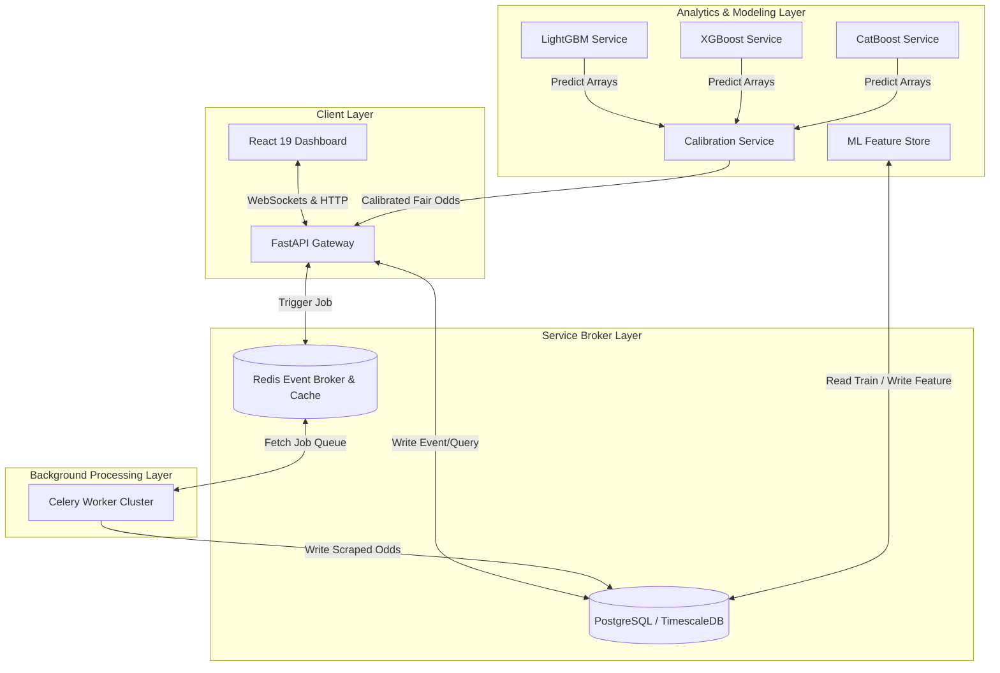
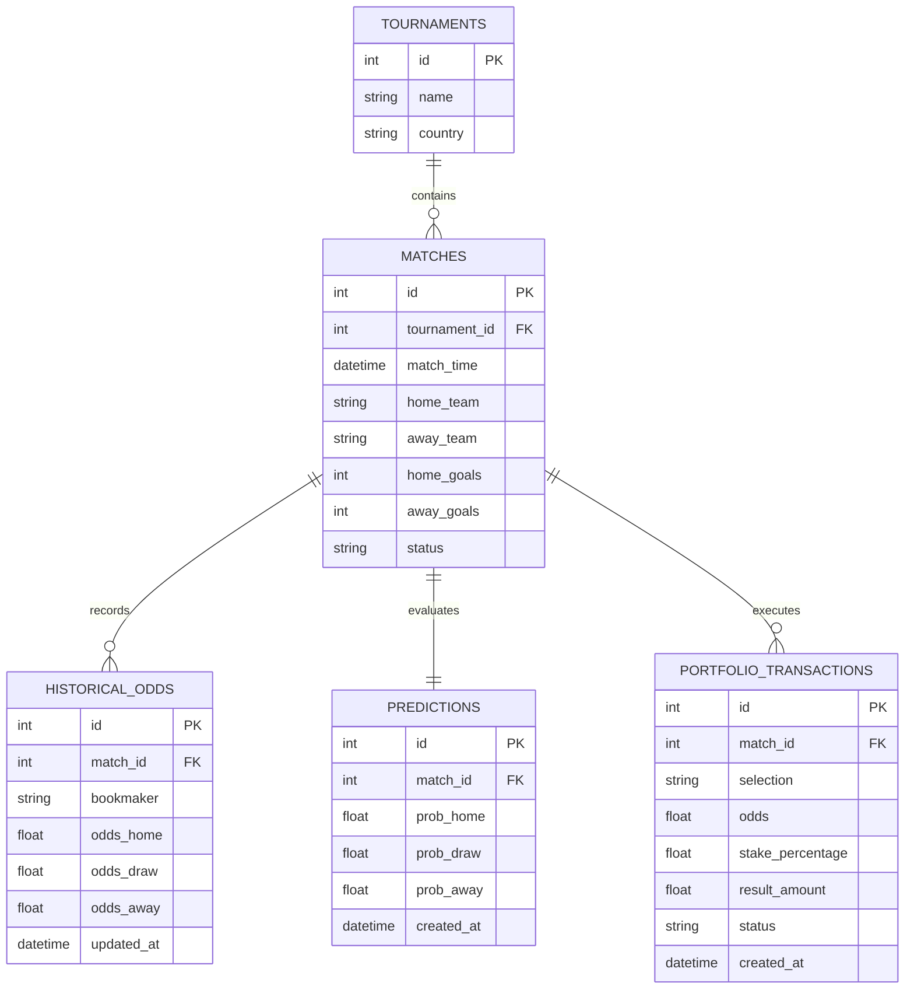

# 🏛️ System Architecture Manual

This document serves as the comprehensive architectural reference for the **AI Betting Intelligence Platform**. It details the structural design, data flow patterns, security boundaries, and infrastructure components of the platform.

---

## 🏗️ High-Level System Architecture

The platform is designed around a modern, decoupled service-oriented architecture, ensuring high scalability, resilience, and operational safety.

---

## 🧩 Architectural Layers & Components

### 1. Ingestion & Scraper Layer
* **Responsibility**: Scrapes public sports bookmaker lines (Betway SA, Hollywoodbets) and historical soccer match datasets.
* **Component Design**: Async Python scraping workers orchestrated by **Celery** and **Redis**. Uses anti-fingerprinting protocols to prevent IP blocks.
* **Database Target**: Writes raw timeseries odds data directly into **TimescaleDB** tables.

### 2. Database & Storage Layer
* **PostgreSQL / TimescaleDB**: Stores structured relational entities (Tournaments, Matches, Teams, Portfolios) alongside timeseries datasets (historical odds movements).
* **Redis**: Acts as the shared state broker, Celery task queue manager, and high-speed cache for live match odds and calculated values.

### 3. Machine Learning Prediction Layer
* **Feature Store**: Builds model features (rolling goals scored, Expected Goals (xG), resting intervals, player availability indices) on demand.
* **Ensemble Classifiers**: Combines LightGBM, XGBoost, and CatBoost outcome probabilities ($H/D/A$).
* **Calibration Module**: Uses Platt Scaling (logistic calibration) to ensure predicted probabilities match real-world historical frequencies:
  $$\\lim_{N \\to \\infty} \\frac{1}{N} \\sum_{i=1}^N I(y_i = 1 | p_i = p) = p$$

### 4. Valuation & Execution Engine
* **Overround Removers**: Strips bookmaker commission profit margins ("juice" or "overround") to extract clean "Fair Odds" benchmarks.
* **Kelly Criterion Portfolio Sizer**: Computes optimal stake allocations using a fractional model to protect capital:
  $$f^* = \\frac{p \\cdot b - q}{b} \\times \\text{Fractional Coefficient}$$
  *Where:*
  - $p$ is the calibrated true model probability.
  - $b$ represents the net bookmaker odds minus 1.
  - $q$ is the probability of loss ($1 - p$).
  - *Constraint*: Clamped to a maximum of 5.0% single-event allocation.

### 5. API Gateway Layer
* **FastAPI Web Server**: Exposes REST endpoints for CRUD actions (matches, portfolios, settings) and WebSockets for real-time odds and logs updates. Uses Pydantic for strict request validation and response serialization.

### 6. User Interface Layer
* **React 19 UI Dashboard**: Built with TypeScript, Vite, Tailwind CSS, and Lucide Icons. Features interactive charts (using Recharts) for tracking value performance curves and portfolio growth metrics.

---

## 🔄 Data Architecture & Schema Definitions

---

## 🛡️ Security & Compliance Design

* **Read-Only Ingestion**: The system only reads public odds pages. No account automation or transactional submission APIs exist, ensuring full compliance with local regulatory guidelines.
* **Strict CORS Rules**: API endpoints enforce strict Origin filtering, permitting connections only from authorized UI dashboard domains.
* **Rate Limiting**: Enforces rate limiting ($60$ requests per minute per IP) to prevent denial-of-service attempts.

---

## ⚡ Future Architectural Enhancements

1. **Horizontal Scaling**: Transition Celery scraper workers into autoscaling Kubernetes pods to handle match days across hundreds of leagues.
2. **Server-Side Rendering (SSR)**: Migrate the React dashboard to Next.js or a pre-rendered setup to improve initial page load times in low-bandwidth environments.
3. **Advanced Calibration Models**: Implement Isotonic Regression calibration to complement Platt Scaling for high-volume matches.
