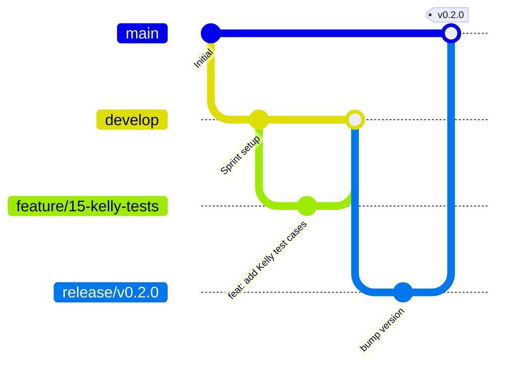

# 🤝 Contributing Guidelines

Welcome to the **AI Betting Intelligence Platform** contributor handbook. Whether you are a human software engineer, a data scientist, or an AI coding agent, this guide details the workflows, code quality standards, and automated checks required to contribute to this repository.

---

## 🚀 Welcome to the Project

As a contributor, you are part of a team building an enterprise-grade quantitative sports prediction platform. We operate with a **highly disciplined, automated, and decoupled codebase**. All contributions must align with our primary goals of maintainability, mathematical precision, and absolute system reliability.

---

## 🗺️ Code Quality & Coding Rules

To maintain high software quality, we enforce strict linting, type-checking, and styling guidelines across all modules:

### 🐍 Python Backend (FastAPI, ML, Scrapers)
* **Code Formatter**: We use **Black** for layout formatting and **Ruff** for linting.
* **Type Safety**: **MyPy** strict type checking must pass on all files. Do not use `Any` or skip type definitions.
* **Docstrings**: We enforce standard **Google Style Docstrings** for all classes and public functions:
  ```python
  def calculate_kelly_fraction(
      probability: float, odds: float, fraction: float = 0.1
  ) -> float:
      """Computes the optimal bankroll allocation using Fractional Kelly.

      Args:
          probability: Calibrated probability of match outcome (0.0 to 1.0).
          odds: Decimal bookmaker price.
          fraction: Kelly fraction coefficient to apply (default 0.1).

      Returns:
          Optimal percentage of bankroll to allocate (clamped to [0.0, 0.05]).

      Raises:
          ValueError: If input parameters fall outside valid ranges.
      """
  ```

### ⚛️ Frontend UI (React, TypeScript)
* **Language**: Strictly typed **TypeScript** using functional React components and hooks.
* **Styles**: **Tailwind CSS v4** utility classes applied directly to elements.
* **Icons**: Standardize on **Lucide React** icons.
* **State Management**: Keep states local, lightweight, and clean. Never update state directly inside the render body.

---

## 🔀 Git Branching Strategy & Workflow

We follow a disciplined **Git Flow** branching model to streamline code integration:



### Git Workflow Steps:
1. **Branch Names**: Create a branch off `develop` using clean descriptive prefixes:
   - `feature/issue-id-name` (e.g., `feature/12-kelly-sizer`)
   - `bugfix/issue-id-name` (e.g., `bugfix/45-cf-rate-limiting`)
   - `docs/issue-id-name` (e.g., `docs/99-api-manual`)
2. **Coding**: Implement your changes incrementally, running tests and linters locally.
3. **Commit Messages**: We strictly enforce **Conventional Commits**:
   - `feat: ...` - For new features.
   - `fix: ...` - For bug fixes.
   - `test: ...` - For adding or modifying tests.
   - `docs: ...` - For documentation updates.
4. **Pull Requests**: Submit a PR targeting `develop`. Your branch must pass all automated CI tests and have a clean code coverage report before it can be merged.

---

## 🧪 Local Test Verification Checklist

Before submitting a Pull Request, you MUST run this validation checklist locally:

* [ ] **Code Formats**: Run `ruff format .` and `black .` to ensure proper layout styling.
* [ ] **Lint Analysis**: Run `ruff check .` and fix all warnings.
* [ ] **Type Safety**: Run `mypy .` and resolve any type-checking errors.
* [ ] **Backend Tests**: Run `pytest --cov=backend tests/` and verify that unit tests pass with at least 90% statement coverage.
* [ ] **Frontend Compilation**: Run `npm run lint` and `npm run build` to confirm the React workspace compiles with 0 errors.

---

## 📝 Pull Request Checklist & Template

Every Pull Request must include a completed version of the following template in its description:

```markdown
### Description
[Briefly describe the purpose of the changes and the problem they solve.]

### Issue Reference
Fixes # [Insert issue number]

### Checklist
- [ ] This branch is synced with the latest `develop` commits.
- [ ] Code compiles successfully with 0 errors or warnings.
- [ ] MyPy strict type-checking passes.
- [ ] Added unit/integration tests to verify the changes.
- [ ] Verified that local test suites pass successfully.
- [ ] Updated docstrings and accompanying markdown documentation.
```
