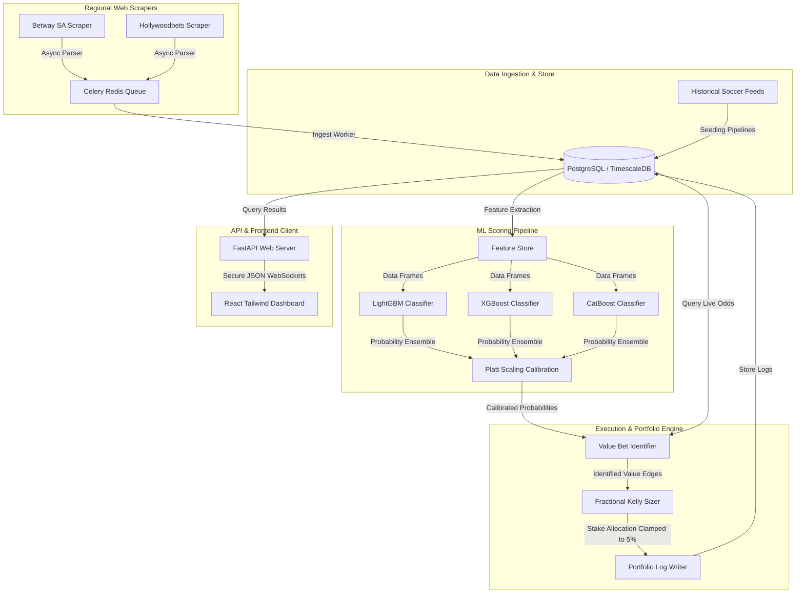
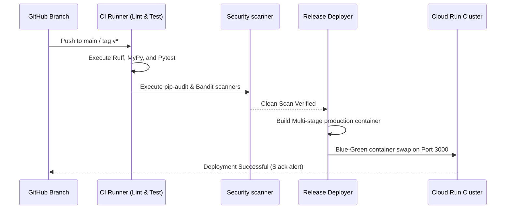

# ⚽ AI Betting Intelligence Platform

[]()
[]()
[]()
[]()
[]()

An enterprise-grade, high-performance sports analytics and predictive intelligence platform. This repository utilizes modular machine learning ensembles (LightGBM, XGBoost, CatBoost) to estimate Home-Draw-Away soccer match probabilities, evaluate price margins across regional South African bookmakers (Betway, Hollywoodbets, etc.), and compute optimal, risk-managed portfolio sizing via fractional Kelly Criterion algorithms.

---

## 🏛️ System Architecture Overview

The system uses a highly modular, decoupled layered architecture, ensuring clear separation between the scraping ingestion systems, machine learning scoring pipelines, portfolio math sizers, and async API handlers.



---

## 🚀 Vision & Key Features

Our vision is to treat sports selection like a modern quantitative financial arbitrage framework—leveraging data-science tools to systematically neutralize overrounds, identify pricing inefficiencies, and manage capital drawdowns with rigorous math.

### Core Features:
1. **Multi-Model Predictive Engine**: Calibrated ensembles predicting match outcomes ($H/D/A$) by modeling rolling Expected Goals (xG), fatigue metrics, and league historical records.
2. **Real-Time Margin Stripping**: Scrapes local SA bookmakers, detects and calculates their built-in margin overrounds, and exposes pure "Fair Odds" proxies.
3. **Automated Value Finder**: Evaluates:
   $$\\text{Value Edge} = (\\text{Bookmaker Odds} \\times \\text{Model Probability}) - 1.0 > 0.0$$
4. **Fractional Kelly Portfolio Management**: Sizing engine restricted to a maximum 5.0% allocation per single slip to guarantee long-term downside security.
5. **Interactive UI Analytics Dashboard**: Dynamic visual charts detailing value historical performance curves, streak logs, active match calendars, and agent logs.

---

## 💻 Tech Stack Specifications

| Core Module | Selected Technology | Purpose & Context |
| :--- | :--- | :--- |
| **Backend API** | Python 3.11 / FastAPI | High asynchronous request-handling and native Pydantic validation. |
| **Task Queue** | Celery / Redis | Distributed background worker queue processing scheduled odds scraping. |
| **Database** | PostgreSQL / TimescaleDB | Relational historical match repository and historical odds timeseries logging. |
| **ML Libraries** | LightGBM / XGBoost / CatBoost | Multi-classifier probability ensemble modeling match vectors. |
| **Frontend UI** | React 19 / TypeScript / Vite | Multi-tab modern dashboard displaying data visualizations. |
| **Styling** | Tailwind CSS v4 | High-fidelity utility classes and premium high-contrast layouts. |
| **Formatting** | Ruff / Black / MyPy | Python linting, automatic styling, and strict type checking. |

---

## 📂 Repository Structure

```
├── .ai/                       # AI Memory, Context, Rules, and Prompt templates
├── backend/                   # FastAPI routing, core business models, and service classes
│   ├── api/                   # Controller endpoints, request schemas, and authentication
│   ├── database/              # SQLAlchemy session setup, tables, and repository layers
│   └── services/              # Kelly calculators, margin scrapers, and analytics services
├── frontend/                  # React dashboard, plot charts, and workspace explorer code
│   ├── src/
│   │   ├── components/        # Extracted UI blocks and system visual tables
│   │   ├── data/              # Static structures and workspace catalogs
│   │   └── App.tsx            # Main interactive dashboard container
├── ai/                        # Preprocessing files, feature stores, and training loops
├── tests/                     # Fixtures, Pytest integration assertions, and Playwright scripts
├── docker/                    # Multi-stage production and dev Docker configurations
└── docker-compose.yml         # Local stack deployment orchestration recipe
```

---

## 🛠️ Development Setup & Configuration

### Prerequisites
- Python 3.11+
- Node.js 18+
- Docker & Docker Compose
- Poetry (Python dependency manager)

### Installation
1. Clone the repository and navigate to the directory:
   ```bash
   git clone https://github.com/your-org/ai-betting-platform.git
   cd ai-betting-platform
   ```

2. Install Python backend dependencies using Poetry:
   ```bash
   poetry install
   ```

3. Install React frontend dependencies:
   ```bash
   npm install
   ```

### Environment Configuration
Copy the sample environment file and adjust the keys accordingly:
```bash
cp .env.example .env
```
*Note: Sensitive secrets (e.g., database passwords, API keys) must be kept out of Git. Declare them in your local \`.env\` file.*

---

## 🚦 Running Locally

### Standard Execution
To spin up the PostgreSQL database and Redis services using Docker, then launch the FastAPI server locally:

```bash
# 1. Spin up the infrastructure
docker-compose up -d db redis

# 2. Run database migrations
poetry run alembic upgrade head

# 3. Launch FastAPI backend
poetry run uvicorn backend.main:app --reload --port 8000

# 4. Launch React development server (Vite)
npm run dev
```

### Integrated Docker Execution
Alternatively, you can run the entire stack (Database, Cache, API Backend) fully integrated inside container layers:
```bash
docker-compose up --build
```

---

## 🧪 Running Tests

To maintain complete computational precision, the test suite executes in three validation steps:

```bash
# Run backend Python unit and integration tests
poetry run pytest tests/

# Execute test suite with statement coverage statistics
poetry run pytest --cov=backend tests/

# Run frontend E2E interface tests via Playwright
npx playwright test
```

---

## 🚀 Production Deployment Flow

We support continuous, automated deployments via GitHub Actions pipelines:



---

## ❓ Frequently Asked Questions (FAQ)

### 1. Does this platform automate bet placements?
**No.** To comply with terms of service and regional licensing rules within South Africa, the platform operates **exclusively as a portfolio intelligence visualizer and decision tool**. Users identify mathematical value gaps via the dashboard and manually submit slips directly inside official bookmaker interfaces.

### 2. What is Fractional Kelly and why is it used?
Full Kelly sizing is mathematically optimal for compounding capital but is highly sensitive to model over-confidence. If the calculated probability is even slightly off, Full Kelly risks severe drawdowns. We enforce a **Fractional Kelly coefficient (0.1 to 0.25)** and a **strict 5% single-event limit** to guarantee high-variance protection during league matches.

---

## 🤝 Support & Contribution
For code guidelines, branching protocols, and pull request checklist mandates, please read our dedicated [CONTRIBUTING.md](/CONTRIBUTING.md) handbook first. For security incidents or vulnerability disclosures, follow the instructions inside [SECURITY.md](/SECURITY.md).

---

## ⚖️ License
Licensed under proprietary terms. Please consult the [LICENSE.md](/LICENSE.md) file for legal permissions.
