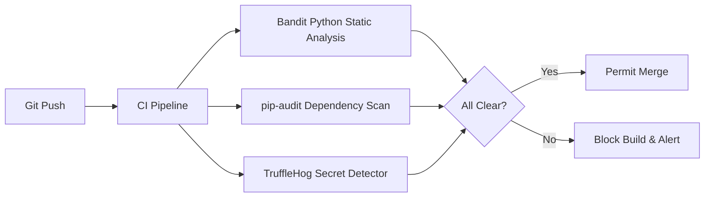

# 🛡️ Security Handbook & Disclosures

This document details the security practices, vulnerability disclosure policies, encryption standards, and compliance boundaries maintained by the **AI Betting Intelligence Platform**.

---

## 🔒 Security Practices & Principles

We prioritize security across every layer of the platform, adhering to the principle of least privilege and maintaining a highly secure, read-only operational model.

### 1. Minimal Data Surface Area
- **No Betting Account Automation**: The platform functions purely as a quantitative decision and analytics tool. It never stores bookmaker account passwords, bank credentials, credit card details, or sensitive financial keys, eliminating the risk of unauthorized fund access.
- **Read-Only Ingestion**: Our scrapers only read public, anonymous sports odds pages. There are no authentication-based scrapers or deposit/withdrawal API routes.

### 2. Environment Secrets Management
- All API keys, database credentials, and secret salts (e.g., `GEMINI_API_KEY`, `POSTGRES_PASSWORD`, `SECRET_KEY`) must **never** be committed to Git.
- We utilize `.env.example` to document environment requirements and load actual secrets at runtime via secure environment managers or Kubernetes Secret stores.

### 3. API Gateway Hardening
- **JWT Authorization**: All endpoints requiring write actions or custom portfolio tracking are secured behind OAuth2 with JSON Web Token (JWT) authorization.
- **Strict CORS Profiles**: Cross-Origin Resource Sharing (CORS) is explicitly configured to permit access ONLY from verified UI dashboard domains, neutralizing Cross-Site Scripting (XSS) or Cross-Site Request Forgery (CSRF) attempts.
- **Rate Limiting**: API routes enforce automatic rate limiting (60 requests per minute per IP address) using a Redis-backed token bucket algorithm.

---

## 🐞 Vulnerability Disclosure Policy

If you discover a security vulnerability within this repository, please do **not** open a public issue. Instead, report it directly to our security team to ensure a safe, coordinated disclosure:

1. **Email Reports**: Send a detailed description of the vulnerability to `security@your-domain.com`.
2. **Details to Include**:
   - Step-by-step instructions to reproduce the vulnerability (including proof-of-concept scripts if applicable).
   - The potential impact of the vulnerability.
   - Your contact details.
3. **Response Timeline**: Our security team will acknowledge receipt of your report within 24 hours and provide a regular status update until the vulnerability is fully patched and resolved.

---

## 🛡️ Automated Security Scanning (CI/CD)

Every pull request or commit pushed to this repository is automatically scanned by our CI/CD pipelines to prevent the introduction of security issues:

- **Bandit**: Analyzes Python code for common security bugs (such as SQL injection, insecure imports, or unsafe random number generation).
- **pip-audit**: Scans the backend python environment for known vulnerabilities in third-party libraries.
- **TruffleHog**: Scans the git history on every push to detect committed credentials, private keys, or API tokens.
