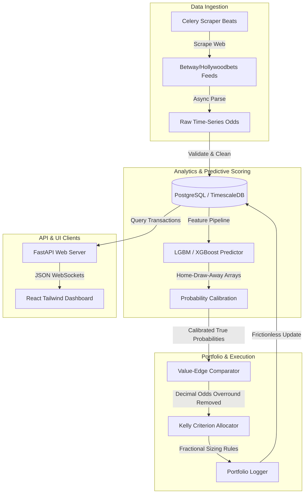
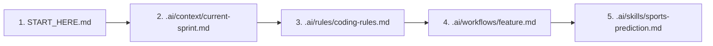
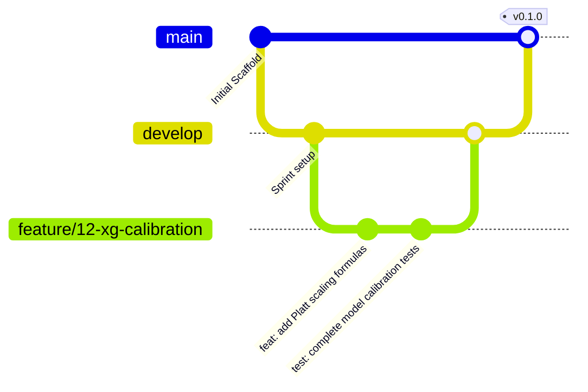

# 🚀 AI Betting Intelligence Platform - Master Onboarding & Execution

Welcome to the **AI Betting Intelligence Platform** developer workspace. This repository represents a fully structured, AI-native, enterprise-grade ecosystem. It serves as the project's permanent memory, ensuring that human engineers and multiple AI collaboration models (Gemini, Claude, GPT, Cursor, Roo Code, etc.) can seamlessly synchronize, design, and write high-performance sports analytics code without losing context or repeating efforts.

---

## 📌 Repository Core Directory & Directory Structure

To keep the development workspace completely synchronized, the repository is divided into structural system directories and a specialized AI context engine (\`.ai/\`):

```
.
├── .ai/                       # 🧠 Permanent AI Memory & Control Engine
│   ├── context/               # Domain-specific logic, active sprints, business metrics
│   ├── memory/                # Active logs, technical debt logs, architectural decisions
│   ├── rules/                 # Coding, database, API, git, and testing rules
│   ├── skills/                # Deep math models, calibration math, sports prediction guides
│   ├── prompts/               # Structured prompting templates for deterministic agent outputs
│   ├── templates/             # Pull request, bug report, and architectural decision (ADR) layouts
│   ├── checklists/            # Quality enforcement and deployment criteria checklists
│   ├── architecture/          # Multi-layer diagram specifications and flow diagrams
│   ├── workflows/             # System workflows (SOPs) for bugs, features, and migrations
│   ├── agents/                # Distinct behavioral profile guidelines for specialized AI roles
│   └── onboarding/            # Detailed step-by-step developer and model guides
├── backend/                   # 🐍 Python FastAPI codebase (Routes, Repositories, Services)
├── frontend/                  # ⚛️ React 19 / TypeScript / Vite / Tailwind UI Dashboard
├── ai/                        # 🧠 ML Model Pipelines, checkpoint stores, and training code
├── tests/                     # 🧪 Test suites (Pytest integrations & Playwright E2E)
├── scripts/                   # 🛠️ Administrative automation & maintenance utilities
├── docker/                    # 🐳 Production & Development multi-stage Dockerfiles
├── docs/                      # 📚 MkDocs Material source repository
├── .github/                   # 🐙 GitHub integration settings & Action workflows
├── data/                      # 📊 Cached datasets and temporary scraping feeds
├── models/                    # 💾 Serialized model weight assets (.bin, .json)
├── notebooks/                 # 📓 Jupyter research logs and validation plots
└── logs/                      # 📝 Application debug logs & profiling traces
```

---

## 🏛️ High-Level Architecture Flow

The system runs on a high-throughput async processing pipeline. The data flow proceeds as follows:



---

## 🎯 Project Goals & Repository Philosophy

The platform operates under a single absolute philosophy: **Systematic quantitative sports valuation managed like a statistical arbitrage hedge fund.**

### Primary Core Scope:
1. **Sports Predictions**: Multi-model ensembles predicting football (soccer) outcomes.
2. **Value Betting Finder**: High-speed real-time odds comparison vs. fair mathematical probabilities.
3. **South Africa Bookmaker Adaptors**: Strict terms-of-service compliance (scraping public data with rate limits, zero automated account-placing).
4. **Bankroll Management**: Kelly Criterion calculations with risk constraints.

### Development Pillars:
- **Enterprise-First**: No loose prototypes. All code must compile, pass strict type verification, and contain structured logs.
- **AI-Native Context Preservation**: No conversational "amnesia". Memory is stored directly in the repo under \`.ai/memory/\`.
- **Test-First Coverage**: Core probability and mathematical finance functions demand 100% test coverage.

---

## 🧭 Required Reading Order for Developers & AI Models

When entering a new session or beginning a task, you MUST read the repository files in this exact sequence to ensure context alignment:



1. **\`START_HERE.md\`**: Understand the high-level boundaries and layout.
2. **\`.ai/context/current-sprint.md\`**: Check active milestones, sprint backlog, and blocked tasks.
3. **\`.ai/rules/coding-rules.md\`**: Align with language style limits, formatting rules, and structural rules.
4. **\`.ai/workflows/\`**: Access the specific Standard Operating Procedure (SOP) file matching your task (e.g. \`feature.md\`, \`bugfix.md\`).
5. **\`.ai/skills/\`**: Reference the deep domain math or technology skills needed for your specific feature block.

---

## 🤖 AI Collaboration Process & Behavioral Rules

All collaborating AI agents are bound by the following behavioral protocols to ensure safety and system cohesion:

- **Check Current Memory**: Always check \`.ai/memory/completed.md\` and \`changelog.md\` before adding files.
- **Documentation Enforcement**: Every public function, class, or API endpoint must be accompanied by comprehensive docstrings detailing inputs, outputs, exceptions, and mathematical formulas.
- **Type Safety**: Strictly typed code only. Never use \`any\` in TypeScript or bypass \`mypy\` validations in Python.
- **Never Overwrite Working Code**: Refactor incrementally. Avoid mass rewrites unless explicitly directed by an Architectural Decision Record (ADR) in \`.ai/decisions/\`.
- **Log Decisions**: Upon completion, you must document your work inside \`.ai/memory/completed.md\` and update the local \`CHANGELOG.md\`.

---

## 🔀 Branching, Commits, and Development Lifecycle

We utilize a strict Git Flow paradigm to organize multiple concurrent feature branches:



### Commit Formatting Standard:
We enforce **Conventional Commits**. Every commit must be prefixed appropriately:
* \`feat: ...\` - Introduces new functional features (e.g., \`feat: add Kelly fractional sizer logic\`).
* \`fix: ...\` - Repairs identified defects (e.g., \`fix: resolve divide-by-zero risk in draw probabilities\`).
* \`test: ...\` - Appends or repairs unit, integration, or E2E tests.
* \`docs: ...\` - Updates markdown files, docstrings, or architectural write-ups.
* \`refactor: ...\` - Code changes that neither fix bugs nor add features.

---

## ⏱️ Session Checklists

### 🌅 Session Startup Checklist
- [ ] Read \`START_HERE.md\` and verify the current workspace status.
- [ ] Review \`.ai/context/current-sprint.md\` to see active issues and assignments.
- [ ] Run \`git pull\` or view the local repository tree to ensure alignment with active state.
- [ ] Run the test suite (\`pytest\` or \`npm run test\`) to confirm baseline health.

### 🌌 Session Shutdown Checklist
- [ ] Verify that all new features and mathematical algorithms contain accompanying tests.
- [ ] Ensure the entire repository compiles and passes linters (\`ruff\`, \`mypy\`, \`tsc\`).
- [ ] Update \`.ai/memory/completed.md\` with files added or refactored.
- [ ] Increment the local \`CHANGELOG.md\` with formatted release blocks.
- [ ] Commit progress using clean, Conventional Commit format strings.

---

## 🔗 Major Document Quick Links
* **🗺️ Project Roadmap**: [ROADMAP.md](/ROADMAP.md)
* **📊 Active Sprint Status**: [PROJECT_STATUS.md](/PROJECT_STATUS.md)
* **🏛️ System Architecture**: [ARCHITECTURE.md](/ARCHITECTURE.md)
* **📝 Change Logs**: [CHANGELOG.md](/CHANGELOG.md)
* **🤝 Contribution Guidelines**: [CONTRIBUTING.md](/CONTRIBUTING.md)
* **🛡️ Security Handbook**: [SECURITY.md](/SECURITY.md)
* **⚖️ Legal Terms & License**: [LICENSE.md](/LICENSE.md)
* **📜 Code of Conduct**: [CODE_OF_CONDUCT.md](/CODE_OF_CONDUCT.md)
